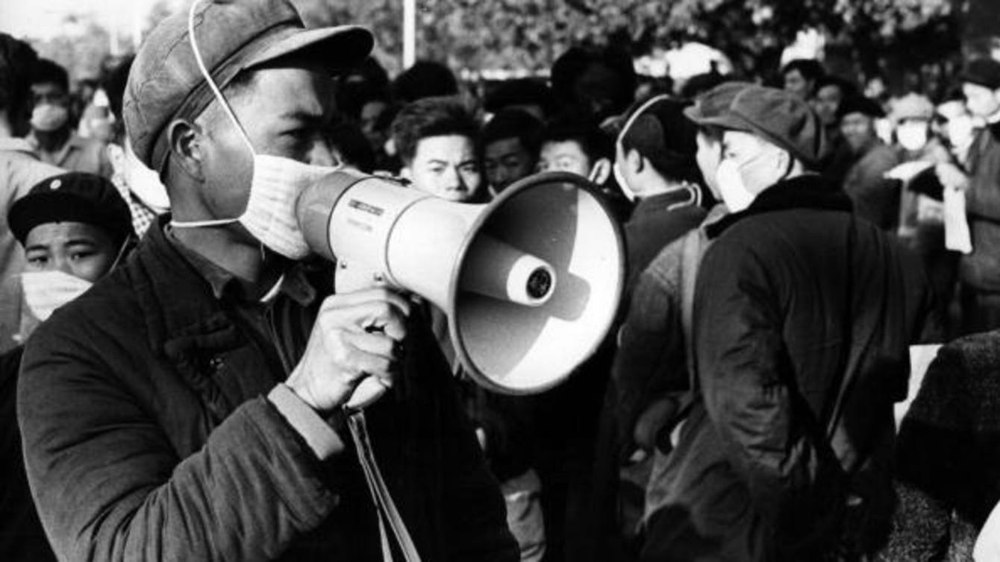

# 麦克法夸尔：文革起源的探索者 -  FT中文网

许成钢：文革结束40年了，但学界的研究仍然是肤浅和有局限的。在有限的研究成果中，麦克法夸尔的贡献不可磨灭。

更新于2019年2月14日 06:24 长江商学院经济学教授 [许成钢](http://www.ftchinese.com/search/%E8%AE%B8%E6%88%90%E9%92%A2/relative_byline) 为FT中文网撰稿

2月11日，著名历史学家、哈佛大学费正清（John King Fairbank）中国研究中心前主任，国际上最有影响力的文革史学者罗德里克•麦克法夸尔（Roderick MacFarquhar，1930.12.2-2019.2.11）教授在家中辞世，享年88岁。虽然早听说他身体不好，消息传来，我仍然被从天而降的震惊和沉痛所笼罩，久久不能释怀。尽管悲伤难抑，但是我知道此时此刻，缅怀故人最好的办法就是用一篇文章来纪念他。

我在哈佛大学读博士的时候，麦克法夸尔是费正清中国研究中心的主任。那时我和费正清中心有密切的来往，因此与他和他周围的许多人相识。他是我的老师辈分，但我和麦克法夸尔有很多共同的地方：我们都是中国文革的亲历者，文革是我们的研究对象。当然，麦克法夸尔是国际上公认的研究文化大革命的最重要的学者。而我至今并没有发表学术性的对文革的直接研究。

麦克法夸尔是费正清的学生。他对文革的研究就得到了费正清的高度关注。在他力荐之下，麦克法夸尔成为了哈佛大学的教授。早在文革进行期间，海外学术界就已经开始了对文革的研究。费正清的《美国与中国》（The United States & China）的第十六章《第二次革命》（即文革），可能是中外最早的研究文革的学术篇章。麦克法夸尔与费正清合编的《中国革命中的革命：1966-1982》，是政治学、经济学、社会学、历史、文学多个领域中国问题专家在哈佛召开的文革学术会议的文集，大体反映八十年代末海外中国问题专家研究文革的水平。

传统上，每年哈佛大学最受本科学生欢迎的课都是经济学的入门课，但是麦克法夸尔在八十年代中后期开设的“文化革命”这门课，连续几年居然成为哈佛大学本科生里最受欢迎的课。来听课的学生爆满，以至于要到剧场里去授课。在这门课上，他播放大量的原始的文革纪录片片段（包括天安门广场的疯狂，破四旧的残暴，夺权的内战，等等），邀请多个来自中国、经历过文革的博士研究生当助教。因为文革既是我的社会科学的学术生涯的起点，也是我的研究对象，我对文革的研究有很强的自己的看法。所以我选择不参与这门课程的助教工作。许多当年麦克法夸尔的助教，后来成为著名学者。其中好几位一直都是我非常好的朋友，比如香港科技大学社会学系丁学良教授、现任麻省理工斯隆商学院副院长的黄亚生教授、克莱蒙特•麦肯纳学院裴敏欣教授，等等。

在海外学术界影响最大的文革研究文献，当属麦克法夸尔毕其学术生涯之功写成的两部巨著：《文化大革命的起源》三卷本（The Origins of the Cultural Revolution: The Coming of the Cataclysm 1961-1966），和2006年与沈迈克（Michael Schoenhals）合著的《毛最后的革命》（Mao’s Last Revolution）。《毛最后的革命》遵循学术标准，力求客观，被学术界公认为最好的文革通史。

《起源》一书系统记录了文革前十年的重要政治和经济事件，是迄今为止以理解文革为目的、讨论发起文革前十年重大历史事件的最重磅著作。该书将大量历史文件组织在一起，对文革和中国当代政治历史的研究做出巨大贡献。但是，该书过于集中在记录领袖人物的文字、谈话和媒体报道上，缺少对制度的分析和理解，尤其缺少对中国极权制性质的基本认识和分析。这是很多文革研究，尤其是海外中国问题专家关于文革著作中的通病：很少关切和讨论苏共对中共建设和性质的决定性作用，包括在中共建党时期；在五十年代对中国建立极权制度的作用；以及苏联-中国极权制的基本特点。多数学者缺少对极权制的基本理解，缺少对极权制在中国的基本理解，看不到苏共极权制与文革极权制的共性，而是过高判断了中苏分歧、冲突等方面的作用。

不了解极权制的性质，就无法理解中共大量的前后自相矛盾的政策。例如1946年相对于1956年、1954年相对于1958年。最重要的是，许多海外中国问题学者无法分辨什么是事实，什么是宣传。此外，多数著作集中关注笼统的现象，缺少对社会内部问题的了解和分析。费正清在《美国与中国》讨论文革一章的第一句说：“从1962年到毛去世的1976年9月，是我们最不了解的时期……因为这时期发生的事件如此怪异，而且使得我们这些外部观察者如此困惑（它们也困惑中国国内的人）”。这句话至今仍然正确。

这些通病作祟，导致很多外国学者对文革这个极其复杂领域的研究有失偏颇。虽然依赖于大量的文献，但是《起源》一书对中国建立和巩固极权制的重大事件所做出的解释却有悖于历史事实的真相。例如，第一卷第四篇《反右运动》，既没有记录也没有关心反右运动中最核心的问题，即各民主党派挑战中共四十年代做出的与民主党派实行“联合政府”以及有限的宪政制度的承诺，而是将阐述的重点置于毛泽东和刘少奇在反右问题的矛盾上。误把毛泽东设计的“引蛇出洞”的阳谋，以及为了“引蛇出洞”而投放的诱饵和噪音当成真相，当成“他内心……所发生的变化”（中文版第261页）。与此相似，书中关于大跃进的讨论非常精彩，但忽略了此前极权制的巩固和强化、反右对知识分子的迫害、对党内的专制的加强（包括要求周恩来在全党面前检讨等）等诸多核心事件，而这些恰恰是发生大跃进的前提。所有这些都是文革起因的重要部分，直接关系到对文革的性质和对毛的性质的理解。

因为学术观点不同，作为尊重师长的学生，我和已是著名教授的麦克法夸尔之间没有很深的交道，只有互相尊重的来往。但是，我与麦克法夸尔的关系中，有一些有趣的经历。在麦克法夸尔的著作中，引用一个重要的证据，证明毛泽东跟刘少奇之间的严重冲突，早在1956年或之前就产生了。 这个证据引用的不是别人，恰恰是我父亲的话（第一卷289页；第390页）。

1957年，我父亲（许良英）被打成右派。作为中国科学院最大的右派，《人民日报》1957年7月底8月初两次刊文批判他。指责他制造党中央分裂的谣言，称毛泽东主张百花齐放而刘少奇、彭真等反对毛。而麦克法夸尔则引用了《人民日报》中揭露批判我父亲的原话作为证据，证明毛与刘早在五十年代中后期就有冲突。为此，麦克法夸尔委托同事与我父亲有过当面交流，也有过直接的通信来往。我父亲曾写了很长的信向麦克法夸尔解释反右运动前后发生的事情，以及证据。我父亲说，他在1957年讲过的那些话，是他在被欺骗的情况下说的，不能作为证据。他认识到自己当时是受骗上当的根据，是后来知道毛泽东自己亲口讲的，百花齐放、百家争鸣是“引蛇出洞”的阳谋，而反右运动是“引蛇出洞”的结果。因此，他希望麦克法夸尔不要引此为证。六十多年过去了，今天的证据清楚确凿，在反右运动上，毛泽东跟刘少奇、邓小平等之间并没有矛盾。但那时，麦克法夸尔坚持认为，我父亲1957年讲的话反映的是重要事实，因此坚持引用当年《人民日报》刊载的、我父亲的那些话作为证据。

有趣的是，他们俩为此争论不下的这段时间，在1988年底，我作为大陆留美学生去台湾访问。那是两岸之间第一次交流，因而颇受关注。回到哈佛之后，麦克法夸尔在费正清中心主持过一场跨学科的学术会，由我们三个从台湾回来的大陆同学钱颖一、裴敏欣和我，报告和讨论相关问题。我注意到，麦克法夸尔和他的同事提到我的时候，称我为“the son”，意指与他争论的许良英教授的儿子。现在想起来，真是忍俊不禁又令人感慨。

我不仅对麦克法夸尔非常敬重，而且在费正清研究中心有很多紧密的合作关系，有许多共同的朋友。他的妻子，一位非常有成就的著名的记者，英年早逝。在她病重期间，我还曾去医院里看望过她。值得一提的是，麦克法夸尔本人也曾经是个重要的记者。

麦克法夸尔对文革的研究之所以做得如此出色，背景之一是文化革命期间，他曾是驻北京的记者。一方面，作为杰出的记者，他大量收集跟文化革命相关的信息；另一方面，他也亲自目睹了文化革命的疯狂和残暴，这是极少数的外国人能经历的。

虽然文革已经结束40年了，但学界对文革的研究仍然是肤浅和有局限的。在有限的研究成果中，麦克法夸尔的贡献不可磨灭。虽然我与他的一些看法不同，但这些仅限于学术分歧，而在学术领域，学者之间的分歧是常态。无论作为人，还是作为学者，在我心目中，麦克法夸尔都令人极其尊重。斯人已逝，言犹在耳。江湖中从此少了一位谈笑风生的智者，惟有幽思长存。

_（注：本文仅代表作者个人观点。责编邮箱bo.liu@ftchinese.com）_

版权声明：本文版权归FT中文网所有，未经允许任何单位或个人不得转载，复制或以任何其他方式使用本文全部或部分，侵权必究。

------

原网址: [访问](http://www.ftchinese.com/story/001081441?full=y)

创建于: 2019-02-14 10:17:35