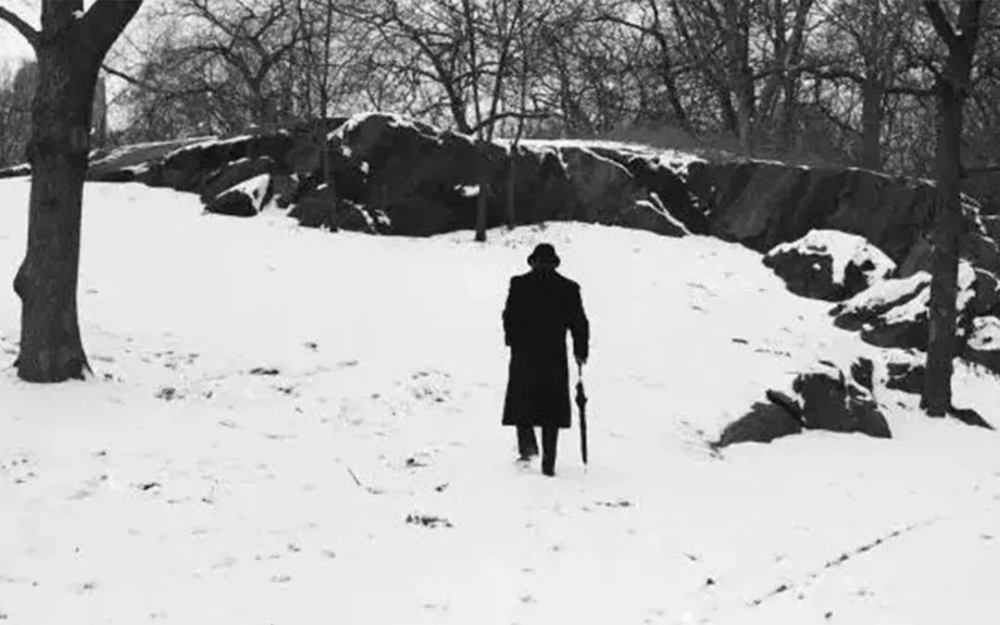
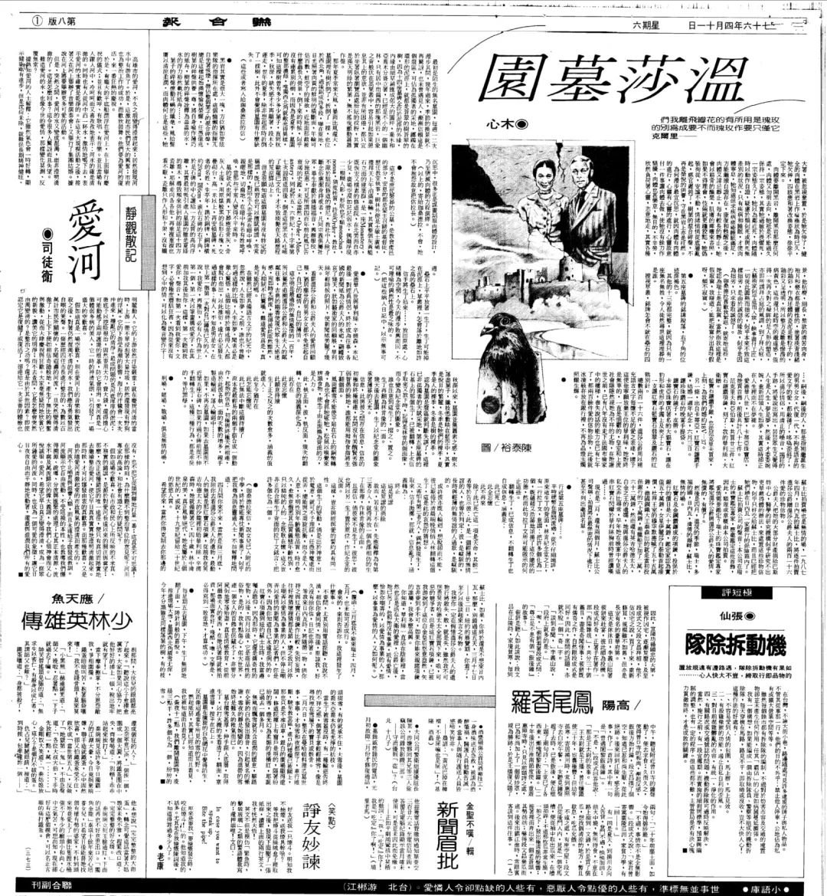
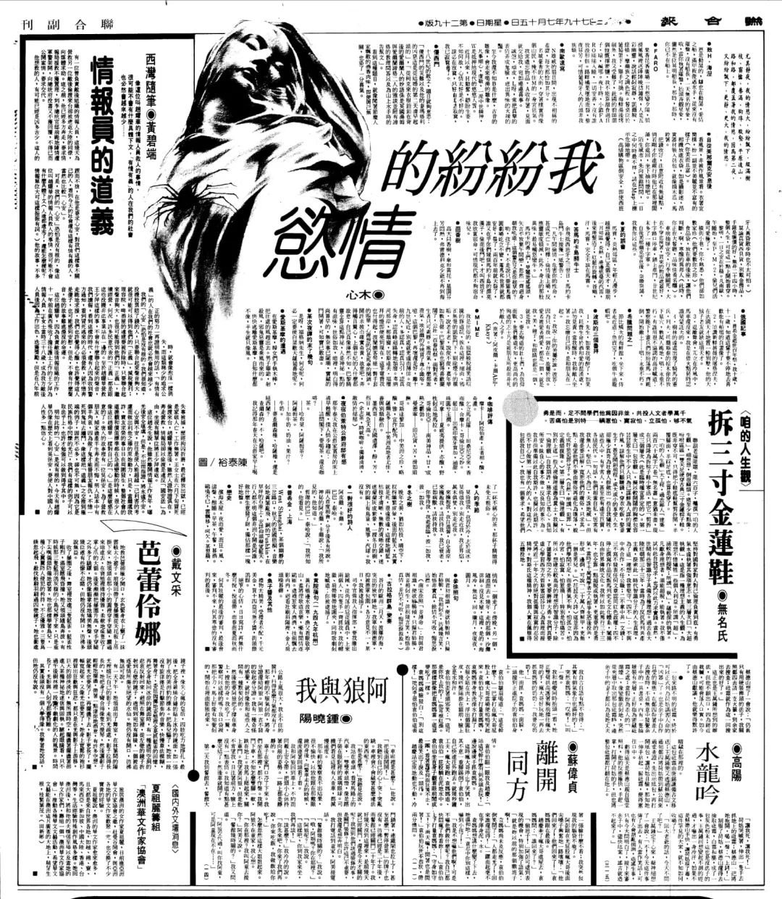
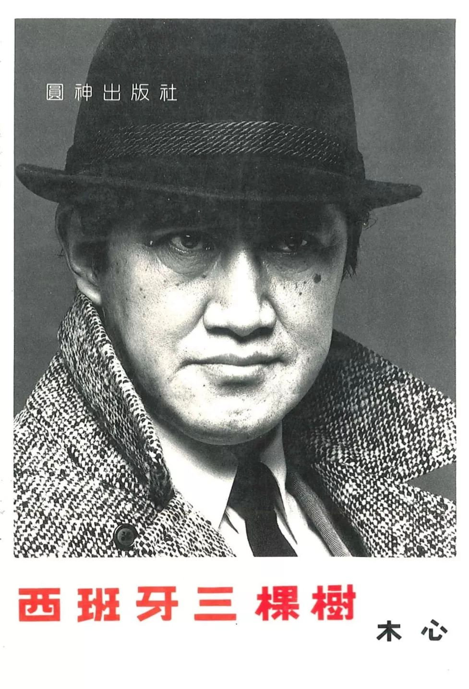
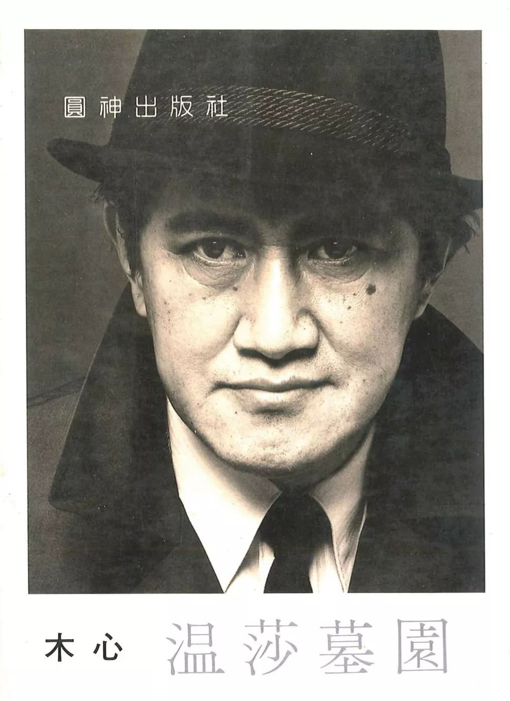

# 文学往事 | 木心“文学再出发”三十五周年， 台港九位文化人谈木心

文学往事 | 木心“文学再出发”三十五周年， 台港九位文化人谈木心

[_东方历史评论_](https://weibo.com/u/1980953575)    发布于 2019-02-14 21:22:37 

​​**辑录：刘道一**  

> 1984年，时在纽约的木心先生，经旅法华裔画家陈英德的登门恳谏、耐心劝服，终于恢复因文革中的抄没手稿、水牢拘囚而被迫中断的文学写作，而其最初一批散文作品即得到时任《联合报》（海外版即《世界日报》）副刊主编的诗人痖弦的击节赞赏，并在联副辟开大幅版面刊登为“主文”，大力号召，而又特别于当年11月创刊的《联合文学》，将木心的名篇《哥伦比亚的倒影》、《明天不散步了》等展布为“木心散文个展”，由此开启了华人世界文学刊物为作家开辟“作家专辑”的历史先河，而这一期的《联合文学》创刊号，也因为木心先生的神思文字，而成为文学传播史上非常重要的创刊个案。在这一开创性的“特辑”之后，著名文学出版社“洪范书店”很快为木心出版了《散文一集》（1985）与《琼美卡随想录》（1986）两本文集，使木心的文学影响，在海外华人世界得到了更为广泛的传播，而与《联合报》《中国时报》副刊的良性互动，也成为推动木心文学创作的重要契机，其后出版的文集也大多为副刊文字的结集作品。可以说，正是木心“回归文学”的这一决定性时刻，才让我们认识现在这样的木心先生。由此，在木心回归写作“文学再出发”的35周年之际，《东方历史评论》集结了初安民、蔡明亮、骆以军、鸿鸿、陈传兴等九位台湾、香港的诗人、作家、出版人的口述实录，沉潜入往时与往思，回顾这三十五年以来，他们与木心先生有关的，文学往事。  

  

## **初安民**

**——**木心是在《联合文学》当年的创刊号，一下子就“出来”了。

初安民，《印刻文学生活志》创办人、总编辑，“印刻”出版的领航者，旗下作者朱西宁、朱天文、朱天心、唐诺、张大春、杨照、骆以军、陈雪、童伟格等所构建的写作脉络，就正是大陆读者视野内的台港文学的最强力代表。在引领“印刻”取得彪炳业绩之前，初先生也是横跨整个90年代的《联合文学》的总编辑，可谓华语文坛继瘂弦、高信疆、杨泽之后的重要推手（没有“之一”）。2012年，推出“木心作品集”13卷。2013年，再推《木心文学回忆录》，获选《中国时报》“开卷十大好书”等年度书奖。近年亦接力“理想国”，推出《木心谈木心》、《豹变》文集。

他的作品很震撼，这个脉络在海外文坛之前从未出现过。30年前的台湾还是个文学的时代，任何作品或者是人，只要能“推出来”，就是个事件。而且当时两大报副刊垄断文学，带来的冲击、经验跟信息，把文学推到一个充满可能的状态。到了《联合文学》一出来，这就是非常让人惊讶的事情，一个身居纽约的作家被放在那么重要的位置，可以说是一扫过去台湾文坛、台湾文学的沉闷感。

2012年，印刻版“木心作品集”推出，邀集台湾名家如杨泽、简媜、蔡康永、杨照、陈芳明、钟文音、柯裕棻、陈雪、陈俊志等“真爱推荐”。开卷处，“引言人”铿锵陈辞：“木心的文章总是空袭式的，上世纪八十年代他的《琼美卡随想录》、《即兴判断》、《温莎墓园》……曾那样空袭过台湾不同世代即使最挑剔的读者。一如叶公好龙，神龙骤临，让我们惊骇、感激、困惑、羞惭……像举手遮眉抬头望向天际，这些穿透二十世纪的文明幻灭或艺术心灵堕坏的灰色长空，如自在飞花，却又如旋风如光焰爆炸的诗句，究竟从何而来？我们阅读木心，他的散文、小说、诗、俳句、札记，如织如梭，难免被他那不可思议广阔的心灵幅展而颤栗。我们为其全景自由的洞见而激动而艳羡，为其风骨仪态而拜倒而自愧。”

但是有一段时间我们就找不到他了，不知道他是什么情况，还有没有在写。消息完全断了。后来直到我找到大陆的也就是广西师范这条线，后来的“理想国”，我也才终于找到了可以做些什么的机会。对我来说是这样，我一开始也是写诗，在我成长的过程中，一路有不少的作家影响过我，给我震撼。我后来做了编辑，让大家了解到这些我认为好的作家的作品，我觉得是一种责任。这样我做好了出版“木心文集”的准备，他们也安排了我去见木心先生。那是2010年，应该是12月份，我就带着骆以军到了乌镇，因为以军跟先生还有另一重渊源，跟他的几本书有关，这个你要让他自己讲了。当时的木心先生身体有点虚弱，但精神非常好很健谈。

这是我第一次见到先生，隔了那么多年，现在想起来，还是非常的感动。面对这样一个巨匠、大师级的人物，我觉得除了时代的差别，还能看出自己的渺小与卑微。作为木心作品的喜爱者来说，出版他的东西我会感到荣幸、感到喜悦。

所以现在问题就出来了，传播有了，但是理解却远远跟不上。木心有点像杜甫，40岁以后读他，你心情会沉淀下来，会了解他的东西。就像当年这套作品集刚出来的时候，有年纪比较长的他说他以前不喜欢，我就跟他说你再回去看一遍吧。之后他回来就说，木心真的好。他没有那种单线索的所谓“师承”的，他是把很多东西都汇聚在一起，做成“木心牌”的。木心最让人感动的是他对人生的通透，了然于怀。同代际的作家都没有达到这种境界，他高出一筹的。他中间没有过场，直接把体悟就给你，你了解就了解，不了解就算了。他的这种没有铺陈，向来为作家带来诟病，但那是你不了解，**他不需要的，一流的作者他不会给你铺陈，也没有花招。**反倒是你越成长，就会越了解他作品的更深层面，就能进到更里面。不过，这些都需要时间、生命的历练、以及对文学的忠诚。这容不得半点虚假。

## **杨佳娴**

——对于木心，我可以说是“二见钟情”。

杨佳娴，台湾“七零后”女诗人的代表人物、散文家，九歌版《新诗三百首》的收束作者，与诗人鸿鸿共同为台北国际诗歌节的核心策划人。台湾大学中文系博士，现任教于台湾清华大学。  

杨淑慧主编，在元尊出版那一系列素色装帧的木心诗集像《巴珑》、《我纷纷的情欲》的时候，我正在读本科。那个时候一进到“政大书城”就能看到这几本，我还能记得是摆在最左边柜子的左边这样子。但是我那个时候读诗，对诗的美学的理解不是往这个方向发展，难免会觉得他写得太淡了，不是那么浓烈的抒情；另外也可能是年纪的缘故，很多东西感觉不能理解。我当时并没有被立刻吸引住，只是记住了这个作者，记住了这个出版社有出很有特点的东西。后来应该是在2006年以后，我在逛简体字书店的时候发现大陆又重出了他的系列作品，像《琼美卡随想录》这些，而且在网路上也开始出现非常多的讨论，这样呢，对于一个曾经读到过、但没有认识到他的好处的人来讲，在看到那么多的热烈的回响之后就会想要反问自己：那我当年是不是错过了什么？我会觉得说，对同一个作者，你在不同年纪会有不同的理解，那你再回头去看的时候会发现，你过去的想法改变了。而且也刚好在我有这种“好奇”的时候呢，诗人鲸向海就送了我一本《温莎墓园》。

 

当我开始重读木心，距我的大学时代第一次看到木心已经有5、6年了，那人都会长大。这次重新看的时候我是从散文开始的，这次就“进去了”。他的散文里有很执着、很专断的部分，也有很通透的部分，很让人着迷。读木心的东西，我觉得你没有办法用我们一般人的各种看法去衡量，我们看木心其实就是应该看他的“偏见”，像他的《文学回忆录》也是一样啊：就是他的“偏见”，才让人特别着迷。而且其实要把这种东西写出来也是要有一种放开来的勇气。我们有时候要发表一种特别的观点，就会想到被人会怎么看我，他在写这些的时候却是完全不管，这一点特别厉害。另外我觉得他有一种幽默感，很吸引人。在台北诗歌节的时候，台下有很多观众提问提到《琼美卡》，有一点的语录体，一般的读者会觉得比较容易接近，也不见得每一部分都能读得比较清楚，但仅就他能看懂的部分，他会觉得很有趣，有的时候还会笑出来。木心能在某句话里为我们展现宇宙爆炸般的能量。 

我从散文“进去”再读木心之后，再回头读他的诗，就开始可以欣赏了。我觉得木心的诗的句子虽然看起来很散文化，但它跟散文的那种带有很强烈的因果关系的句子还是很不一样的。我后来几年在写诗的时候，会受到木心这种“松”的语法的影响。读他的诗，我会默念那些句子，去找寻他的方式，好像在和他对话。我是几乎每年都会开《红楼梦》的课的，那我近几年就开始尝试将《红楼梦》的那种贵族之家走向衰败的长卷式的书写同木心的写作做比较，木心也是有那么强烈的贵族气，以及对不美的东西的他的那种批判性，但他没有那种铺陈性，而只是点出了整幅图画的几个点而已，而且这些点真的就点得很开，这些点之间又保持的很妙的那种联系，只是这种联系要靠读者本身的能力、理解力去做填充。诗是最依赖读者素质的一种文类，读木心的诗更是如此。几年前，我们在台北诗歌节也专门办了“重读木心”的单元，就是希望这种文学阅读的修炼，可以不断地传承下去。

那现在我每次在清华开“城市文学”和“成长小说”的时候，都会专门讲到木心。在“城市文学”的部分，会选他的《上海赋》，那首先是因为他在现代汉语的意义上，要展陈这种“赋”的规模，是非常了不起的尝试，后来者可能也少了他的那种修养跟精神，一时很难再出现这样的作品，同时我觉得他的“上海”是真切可感的，非常有细节，会让中文系的学生一下子就进到某种独特的格调中。而在“成长”的主题下，我通常会选《童年随之而去》作为一讲，那里面的含蓄的力量，是可以有很多可以讨论的地方。而同时我也会想说，木心的大部分的文学作品，都是非常内敛，很潜沉的表达，这就会在教学中造成困难，或者说困扰，因为那样的作品，其实是不能完全用“解剖”的方式打开来“看”的，会完全失去了妙处。也许换个角度来说，木心的文学特质，就是要求，甚至是逼迫着读者，必须自己跟他建立完全是“个人”的关系，和联结。

## **邓小桦**

——我对木心的阅读，最关键的是：从自己的阅读感受出发，没有“大师焦虑”。

邓小桦，集散文家、文化评论人、诗人、艺术策展人于一身的香港文化人，“香港文学馆”总策展人，香港电视台“文学放开讲”主持人，亦于香港浸会大学等高校开设文学类课程。  

我最早接触到的木心，就是《我纷纷的情欲》这本诗集，咖啡色的封面，没有更多的介绍，好神秘的样子。当时我在中大（香港中文大学）读书，教现代诗的老师是诗人孟浪的太太，杜嘉琪女士，她看到我有这个疑问，就回答我说：你不知道他啊，他很厉害啊！就是这样子，完全没有说一些教条，文学史上常有的论点论据论证，而是说，你要读，读就是了，不会错的。这是我们谈论好的作家和作品的方式，很私人化，像之后也是的，到差不多09年的时候，梁文道就也跟我提到了木心，“《哥伦比亚的倒影》，真的很好看。”那就是，要拿来看的意思，很简单，并不是当时香港的社会上在讨论木心，然后我们也来议论一下，香港的文化生态也不是这样子的，而是说，如果他读了不喜欢，根本也不告诉你，但是反过来，用教科书的方法读鲁迅，我也是会迷路很久，不知道如何是好。

 

那这下我就真的都找来读了，能找到的都通通买下来，我的习惯是这样子的，不要留下死角，因为我没有所谓的“大师焦虑”嘛，什么他到底是不是大师，读书，尤其读文学书，不应该这样子的，迷信权威的结果只会是败坏掉自己的辨识能力，最后一无所获。那从那时候开始，一路读下来，我最喜欢的是《素履之往》，断片式的写作，让我联想到鲍德里亚的《冷记忆》（Cool Memories），那样集中的“刺激”，不断一直来一直来，让精神高度兴奋的，仿佛阅读上的纵欲，让人“过High”。**可是木心又和Baudrillard或在拉美的Galeano的那种断片集不一样，因为他有中文的、中国的内蕴在，会让人可以在阅读中获得高度的快感，但是又不会伤到自己，他把那种锋利用绵密的思绪缠绕起来，就可以一读再读，同时每次能让你超出文本的限度，带你到另一个的方向。**  

在这样细读木心的时期，我也去到香港刚开幕的诚品书店工作，那个时候印刻版的“木心作品集”刚好出版，一整套的马卡龙配色，在书店占据了很显眼的位置，也让香港的读者开始认识的到木心的重要性。后来到2013年，我离开诚品，就有在一个书店组织叫做“任性读书会”，每次选比较有知识分子关切，但又不是那么偏门的作家作品来讨论，这样就也会选到木心，那一次让我看到了木心在香港的读者的面貌，非常的有趣，大家感兴趣的书和有感触的点非常的不同，这一点应该跟大陆和台湾的读者也有极大差异，我们就是这样，每个人凭借自己的判断来读书，读到自己喜欢的部分，就最重要了。

再后来我在浸会大学有开一些文学方面的课程，其中当讲到“离散文学”的时候，我都会选讲木心的篇目。我说过木心几乎是梁文道我们这个小圈子的一个“私藏”，某种秘密结社的“徽章”，因为我是读文学出身，那有一些华文的作者，是那种如果世界大战爆发，我一定会带在身上逃亡的，台湾就是杨牧跟夏宇，香港是游静和钟玲玲，大陆我会选木心，可能也有鲁迅，但就不会有张爱玲。因为这是私家名单，没有文学史包袱，带上就对了，无论到哪里可以给我“生命”的感觉。那这样放回到“离散”这个题目上了，我想他是非常特别的个案，当然我们大家都知道他再次开始写作是在纽约，迄今为止绝大部分的出版的文集都是在美国完成的，但是他并不能被归类成一个传统意义上的“旅美作家”这样子，包括他的“世界文学史”讲课，也并不是一种“离散”意义上的宣讲，“感时忧国”什么的，他的那种贵族气，其实张爱玲也是没有的，那种虽在域外，但内在很稳固的气场，那种“范儿”，反倒是大陆本体上，比较没有这种底气了，断了，也隔了，“小时代”了。这也是可能我觉得，木心美术馆现在这么受推崇的原因，大家走过去一看，“喲，这个对了！”

## **骆以军**

——在印刻出版“木心作品集”之前，木心最后在台湾出版的一批书，就是杨淑慧在远流下面的“元尊文化”做出来的，比如《会吾中》（即《诗经演》）、《我纷纷的情欲》，当时，我就是杨淑慧手下的小编。  

骆以军，1967年生，华语文坛最名副其实的“大肚量”小说家，2018年联合报“百万大奖”得主，在完成“红楼梦奖”得奖作《西夏旅馆》后，又接续推出了长篇小说《女儿》、《匡超人》。近年参与文学写作计划“字母会”，将“智性书写”推向新的文学史高度。  

那个时候我的一个工作就是要熟读木心以前在洪范、圆神的作品，然后以杨淑慧的口吻来给木心写信。我的老板杨淑慧，她不是文学出身，但是在出版上有特别的判断力和精准度，那我等于是要拟用一种女性的思考方式来和木心对话，让木心觉得，有必要拿书来给这个出版社出。每次写完之后，杨淑慧就把我写的稿子自己誊一遍，寄给木心。很快的，通过几次信之后，木心就同意把他的书给元尊来出版了。  

我写第一封信的时候主要谈了我对《温莎墓园》的理解，因为《温莎墓园》是我少数“抄”读过的华语作家的作品。我在阅读上的准备很够，还包括圆神出的《即兴判断》，我都在研究。讲这些之外，就是要提出出版计划。木心收到信以后，很快的回信，也非常的热情。他的用辞考究，可以看出老派的教养。那这样有几次的往返，木心就给出了他的书单，像《会吾中》、《巴珑》、《我纷纷的情欲》这些都在里面，每一个题目下边是介绍，讲里面是什么样的内容。这就是元尊的那些书的出版的经过，只可惜后来木心的那些回信都收在杨淑慧那里，她过世之后应该也就湮灭了。

老实讲，年轻时我读木心常似懂非懂的，不解其意。他那些警句里繁若星辰的大哲人、大艺术家、大文学家，我大部分都没读过，只能感觉到抒情的启动或者终极辩证的机锋后头，总有玄奥巡航的语义魔舰穿刺生活的真实面，检测、棒喝、遁逃，却又痴情般地展示一幅已灭绝了的，像光焰熄灭前一瞬的辉煌残影，像《红楼梦》一样的智性的文明场景。这也就是浓缩在《温莎墓园》这本集子里的文字，各自遮藏隐蔽、欲语还休，有如“雾中风景”让读者只能对文字背后的“整片森林”绝望想象，或者想象这种种的“彼岸性”：曾经如此繁丽的文明全景；曾经如此和谐的人文宇宙；曾经如此严守风格风骨的文人丰仪；曾经如此守诺重情的义理秩序。那分明在提示的，“全人”该是如何的言行、自由、潇洒、高远。**于是，木心也就构成了一个迟来的“文艺复兴”的悬空的期望，让人无言以对。**

所以这也是一直以来我们理解木心的一个困难，一个理所当然的困境。就像在台湾的他的引进，也是需要有老一辈的、有大视野的人来看到，才会知道说，这个是张爱玲的等级，或者这个是梁实秋的等级。但是就像他《琼美卡随想录》的背后所盛放的如斯庞大的那个“共享的大书单”，其实已经失落了、不传了、毁灭了，他的教养，以及关于教养的追忆逝水年华都被阻断了。因为文革，也因为新的写作技术对于传统的遗忘。这让我回想当时我在大学，在阳明山的宿舍里读《温莎墓园》的场景，那个时候我完全沉浸在卡夫卡、福克纳、加缪、卡尔维诺、昆德拉这样一些现代主义想当然、硬梆梆的原型系谱中间，我会在现在开始反省，反省木心这样一个文学书写的“否证”：也许你还是应该回过头来，更扎实地让自己成为一个完整的“古希腊人”。

## **隐地**

——木心，我们那个时候都读他，他可以说是“作家中的作家”。

 1937年出生的隐地先生，上海人，1948年随父亲赴台，是目前台湾辈份最长、但也仍然相当活跃的出版人、作家、诗人，于1975年创办的尔雅出版社，如今已成为台湾纯文学类出版社中经久不衰的品牌典范，旗下作者包括纪弦、洛夫、王鼎钧、白先勇、席慕蓉、林海音等重量级作家。  

他的文字很好，一流的作家，毫无疑问。我们那时候几个老朋友碰面，都是搞写作的、做出版的老朋友，有时候瘂弦就会挑头问：最近有看木心的文章没有？我们就赶紧说：“有！”不过是真的有啊，不是客气话，因为都要说出好不好，怎么个好法来。后来有的时候，瘂弦不在的时候我们也互相问，那好作家、好作品，我们都爱议论嘛。台湾八十年代的氛围就是这样，政治还没有解严，但文学上已经非常可以讲话。

他的文章还有一个好处，可以用来消遣人，非常的犀利。比如他有一句话：“那个人的脸丑得像一桩冤案。”你说多厉害，我们当时不知多少人被这句话“冤”来“冤”去的。另外呢，我也曾经给他写过信，不过不算是约稿。那个时候我要编一本《十句话》，就是每位作家我会选十句话，都是“精句”，那木心我也选了十句，我就写信给“木心先生”，他刚好比我大十岁嘛，我就称他先生，说我要选你的这十句话，看你能不能答应。结果木心先生很爽快的回信，我是上海人他是乌镇人，大家“隔壁邻居”的，后来我就用了他的这“十句话”。

**“生命是时时刻刻不知如何是好。”——他就是知道，如何能写到最好。**

## **叶步荣**  

——我一接到他的信，马上打开来看，哇不得了，说到出书，“布面精装，烫金字体”：这就是木心的高要求，他的“完美主义”。  

叶步荣，华人世界最重要的文学出版社之一的“洪范书店”的创始人、主要经营者，于1976年与友人痖弦、杨牧共同创立出版品牌“洪范书店”，不断推出影响卓著的文学书籍，如《痖弦诗集》、《奇莱前书》、《奇莱后书》、《家变》、《背海的人》，林文月译本《源氏物语》及繁体版《红高粱》等。木心最初的两本文集《散文一集》、《琼美卡随想录》即在洪范出版。  

那个时候痖弦在主持“联副”，发表了很多的木心先生的作品，我们看了都很喜欢，加上又有《联合文学》的创刊号，影响很大，读者也有热情的回应，我们就说，应该出书，杨牧那个时候也是非常的支持，他很喜欢木心的文字。

不过在出版上痖弦有一点为难，因为当时联合报系的联经出版社也说要出木心的书，这样就会有一点的拉扯，那后来我就写信给木心询问，木心先生很爽快的回答，那就两边各出各的，问题就解决了。当时在洪范先出版的是《散文一集》，我看后来的《哥伦比亚的倒影》、《爱默生家的恶客》，算是重新分配了集子中的文章，而《上海赋》那个是比较后来的作品。那《散文一集》可以说就是集合了当时在两大报副刊上最大版面篇幅的文章，有点众星捧月的意思。这个时候木心对书的设计要求也来了，他想要做当时大陆、香港都做不出来的书的样子，他本身又是艺术家，就很细致的做了书的样本，封面用什么布，染成什么颜色，色号什么的，样样俱全，我们还真是没有见过这样的作者。那确实我会有一点为难，他的这个制作规格，我们这家小小的文学出版社，实在是承受不起，花费太高了，只好写信跟木心解释情况，很不好意思，那木心先生也表示理解，就重做方案，那个时候没有电邮，全部都是航空信，这样一封一封的，往复讨论。

八十年代的洪范出书，是有一个基本的规尺的，比如封面一定会有一个线框，图文都在框内放置，那木心不喜欢，他就要去掉，我们也照做。“洪范书店”四个字，是台静农先生的题字，会印在书脊，是我们社的标志，同时会标出“文学丛书”的号码，因为那个年代没有电脑录入，所有的书店进货和陈列书，都要按照我们的这个编号，一看到缺哪几个号码的书，一目了然，非常清楚，但是呢，这些木心通通都不想要，他有他自己的美学观点，他自己设计。那么经过讨论，我们也都接受了他的方案，整个八十年代，只有他的书，是特别的样子。

那之前提到联经要出的书，其实就是《琼美卡随想录》，洪范出书之后，联合报那边后来就没有跟进，那这样，第二本也转到洪范来了。这一次有了之前的经验，我就跟木心写信说，可以分成两种封面，在美国及海外销售的，完全按他的设计，而在台湾香港出售的，则还按照洪范的规矩，文学丛书的编号也照旧，这样方便在这边流通，木心说这个主意好，这样台湾就有了两种封面的《琼美卡》，据说现在有线框的版本，在二手书市场上被炒高价，就好像有木心特辑的《联合文学》创刊号。

两本书出完，我刚好有机会到美国一趟，就去找了木心。老先生当时很高兴啊，可以说兴致勃勃，跟我讲，他还有三本书要出，都整理好了。我只好说我们社太小了，没办法一下子“吃”下去，最好就一本一本来。那我走后不久，圆神出版社的老板也到了美国，那相对于洪范尔雅，圆神是大出版社，那时候是木心的友人曹又方带着去见了木心，木心应该是又讲了三本书的事，圆神很快就答应下来，不久一下子出版出来，就是《温莎墓园》、《即兴判断》和《西班牙三棵树》。

现在想来，木心在台湾的读者，始终都是文学金字塔的塔尖上的，因此是很稀有的，都是很厉害的人会谈论，但不是大众。这也就导致了，圆神后来也并没有跟进出版，再让我对木心有印象的，应该就是杨淑慧在元尊文化的时候，推出的那几本像《我纷纷的情欲》，不过有趣的是，他们也都没有试着去做过“布面精装”，不知道这是不是木心本人的一个遗憾。  

再后来，木心过世了，在2012年，为了纪念他，我们重做了《散文一集》和《琼美卡随想录》，其中《散文一集》他当年有做两个样式让我们选择，这次我们把两种封面都做出来，分别是手绘图案版的和手写签名版的，这样让读者可以自己选择购买。今年，我又整理了当年在编辑、制作《散文一集》、《琼美卡随想录》时期跟木心的通信，以及他当年手工制作的封面图样、内文版式（他真是对每一个字的位置都要求的很详细），都捐赠给乌镇的木心美术馆，让年轻的读者可以了解到那个跟现在相比几乎是“原始”的出版时期，老作家和编辑人的互动，以及木心对文学、对艺术、对生命的执着。

## **蔡明亮**  

——《文学回忆录》这部书，我读了两遍。    

蔡明亮，台湾“新电影”大导演，以《爱情万岁》、《洞》、《你那边几点》等名片享誉国际影坛，09年电影《脸》更成为被卢浮宫收藏的首部剧情长片。2012年的电影《郊游》获威尼斯电影节评审团大奖，同时也成为“金马五十”的最佳导演、最佳男主角得主。2012年1月初，蔡明亮收到友人赠送的刚刚在大陆出版的简体版《木心文学回忆录》，其时，《郊游》正在前期拍摄中。  

我想，是这本书，最能让我了解木心这个人。他非常的博学，非常的宽广，而且非常深邃。这样的一个文学家、创作者，他又会花那么多的时间，在异乡的美国给那些学生上了整整五年的课，中间也没有间断，真的是对文学跟艺术非常的热心、非常的热血。

像我们这些不是做文学的人，读书都很杂，不是那么系统，都是跟着年龄走，那个年龄过了就过了，很多该读的书都没读。木心的讲学，真的是给了我很大的提醒。我太开心了。这本书我读了两遍，在旅途中也带着现在又开始重读了。我刚刚还跟听我课的同学们讲，一本好的文学史，不应该那么硬梆梆的。木心的讲述是很随性的，但又有系统，非常能看出他的性格，这个文人的性格。这个才是我看重的。他的感觉也很准确，他的评析、他的观点都很贴切，我也常常被吸引去在回头去看世界文学史上的那些作品。在读这本书的过程中，我又去找了托尔斯泰的书，因为我们之前都是关注他的那些大部头的作品，那些小的东西就被忽略了，没有读到，很可惜。还有很多他讲的日本文学的部分，是我重点在重看的，给我很多的启发。所以这就是让我开心的地方，我会想，即使我的下半辈子的时间不多了，但是我不会怕啊，因为我又发现那么多值得去读的、去思考的东西，这个是他有影响到我、帮助到我的，我要谢谢他。   

而且我觉得，作为一个创作人，跟着这个时代去走也不是那么的正当。所以木心的一些观点我也会特别认同。比如他会说：大众是瞎的。我觉得太对了。因为这倒不是说大众、或我们的观众是真的“看不到”，而是说他们不可能“提前看到”，不可能你的尝试还没有真的做出来，他们就已经“懂”了，这些都需要时间的。但重要的是，你是不是有在认真做“创作”；你如果要为大众去“创作”，那你根本就不要创作了。

而说到木心与台湾的关系，我确实也发现我的情况和他有些相似。我觉得台湾，特别在文学上，它还是一个文化传承比较坚实的地方，它是一个文学的集中地。它没有经历文革那样的过程，文学很好地传承下来了，所以会看得“懂”木心这个人，张爱玲也是一样啊，她也是从这边得到被“看到”的“位子”。那相对于我，我是马来西亚人，你知道那种海外华人的社会的生存状况，还有各种的排华的、压抑华文的风气也都非常严重。**总体来讲，华人世界的其他地方也都还是在“过生活”而已，“活着”就好了，不是还有很多地方连呼吸都困难的。**所以，基本上我觉得木心的情况很正常，他只有离开内地才能有所发展，他的舞台其实是台湾，不管那个时候他离得有多远，他的舞台就在台湾。像我也是，我的舞台是台湾。我留在马来西亚，我可能就不是个导演；我如果去香港，也不会是这样的导演，可能就是个商人了。所以我觉得，我们还是要回头再看看这个地方，看看它所承载的东西，这还是蛮重要的。

## **鸿鸿**

——我的第一本木心，是周公（周梦蝶）送给我的。  

鸿鸿，著名诗人、编剧、剧场导演，“黑眼睛文化”创办人。与夏宇、陈克华同为接棒郑愁予、梅新的《现代诗》“复刊”主编之一，后创办《卫生纸》诗刊，同时也是台北国际诗歌节总策划，2013年诗歌节“重读木心”单元的策划人，而他的电影编剧作品中最广为人知的就是由杨德昌导演的《牯岭街少年杀人事件》。  

那个时候我正在编《现代诗》的复刊号，当时我每过一段时间就会把“现代诗”出的诗集寄给周公，那因为周公是1921年生人，那个年代的人物有很多老式的教养，所以他收到了书就会“还礼”，寄回给我一些他认为我应该看到的书，所以我后来就收到了他寄给我的那本《温莎墓园》，里面还有周公用他的“瘦金体”写的赠语。我后来发现他真的是送给了我一件珍宝。又过了不久，我帮梅新先生编《八十二年诗选》，也就是1993年度的诗选，那时候我翻遍了当时的报纸副刊和文学杂志，这个时候我就在《中国时报》的“人间副刊”上发现了一个笔名很怪的作者写的《肉体是一部圣经》。我不知道作者是谁，但是这篇作品完全把我给抓住。那个作者仿佛是一个老琴师在“弄琴”的感觉，很有历练，很有沧桑感，又温情又冷酷。“切齿痛恨而切肤痛惜的/才是情人”。我觉得非常好，就选了。这是我认为那一年最好的一首诗。选完之后我找杨泽问这个作者的联系方式说我想通知他我有选上这一首，杨泽就告诉我说，“这个人就是木心”。我当时大吃一惊，才发现原来周公推荐给我读的那个散文家也可以写出这样好的诗。

后来我的阅读就集中在《素履之往》和《同情中断录》。《素履之往》是那种有一点类似格言，但又不是真的格言，是他自己的一些有独特味道的判断和观察。那个时候读起来，就觉得他是一个有很多想法的才子，但因为我还不清楚他的整个思想脉络，书里面的很多东西其实还读不出来。所以也没有想去再深入地考察这个作者，只是觉得他是一个奇才。而到了《同情中断录》情况就完全不一样了。这可以说是一本“怀人”主题的文选，里面有写他的学生、写席德进、写林风眠，我读起来觉得非常的震撼。那时候可能我自己的年纪也到了，等于隔了五年——从我编“八十二年诗选”到读《同情中断录》，然后我突然全部都读懂了，也了解了他写的东西，并深深着迷于他的文字。譬如他写到林风眠，他并没有写自己，但他自己其实始终在里头。林风眠经历过的创伤我相信他自己也经历过，所以他能写得这么好，但他事实上又高出一层，因为他自己有做艺术上的判断，这非常了不起，他在艺术上的“冷酷”。后来我就把这本书推荐给所有人，我说他就是“中文世界最好的散文家”了，毫无疑问。

最近最开心的就是在读他的《文学回忆录》，读时我会联系到他的《素履之往》，才发现原来他的脉络在这，也才会从这里发展出《素履之往》，我恍然大悟：原来是这样子的！才知道光读这个《素履之往》是不行的。你觉得这是一个天外飞来的天才，其实不是的，而是经过先前的经验判断之后他得出来的自己的反思结果。我们这些“凡人”就只要跟着这些足迹去重看就好了。我读《文学回忆录》的感触非常多，其中一个就是，他的文学素养、他阅读的范围，主要是70年代之前出版的作品，那个文学的养分是跟我们这代人是完全不一样的。就比如哈代,我读了非常惊讶，因为我从来没想过要读哈代，哈代对我来说就是一个老作家，是《德伯家的苔丝》的原作者，但是我只要看电影就好了，我并不要去读他。但是当我看到木心把哈代放到这么高的位置上，我就立刻跑去买了所有能找到的哈代的中译本，准备后面一年好好读。他就是不断给我功课要做。而另外一些，比如说他写契诃夫，契诃夫在他的心目中没有很高的位置，他也没有提到他的剧本，因为我是搞剧场的，这一点我就不大同意。但是阅读过程中，不管同不同意都要在脑子里较量，这让我很享受这个读的过程，让我一直有一种对话感，感觉还蛮过瘾的。他的每一句话都有说到我的心里去，我都要拿我的阅读经验去回应、去对照，所以我读的非常慢，每天大概只读两页，觉得读多了就很浪费，那个不断反思的空间就没有了。

木心的长诗，我现在读下来，觉得非常有味道，那种悠慢的时间感和细部观察的剖析感，都有不同于台湾的诗歌传统所给出的阅读体验，当然《从前慢》的文字反倒不是最有代表性的。可以说他是又潇洒又矜持的一种态度，非常迷人。那么潇洒就是就在于说，他一切都了解，没有不能写到、写透的；矜持呢，是说虽然他没有不能写的，但是最后写出来的其实非常少，惜字如金。我还是讲《肉体是一部圣经》，这里面就充满了这种张力，就是说诗本身承载了很多东西，但他只写这么一点点，冰山一角，哇，让你觉得这后面简直就是一部长篇小说，只是他没写而已，他就写成了一首诗。

## **陈传兴**

——我最初读到的木心，就是《雄狮美术》的“清泉小丛书”里的《素履之往》，觉得这才应该是一个艺术家拿出来的文学作品，智慧与美的一种平衡。  

 陈传兴，法国高等社会科学学院语言学博士，台湾清华大学荣休教授，著名摄影家、电影导演、文化学者，行人出版创始人，目宿媒体“他们在岛屿写作”第一、第二系列文学电影总监制，同时为其中《如雾起时》和《化城再来人》两部电影的导演，最新电影作品为记录叶嘉莹先生人生故事的纪录片《掬水月在手》。  

但是最近呢，我就对他新出版的这本《文学回忆录》特别感兴趣。因为他的在八、九十年代的纽约发生的这种讲授，就刚好可以对照台湾的七零年代的那种类似“私塾”的讲学，也就是那种围绕着一位“宗师”而建立起来的society。比如南怀瑾、比如牟宗三、当然还有被请到朱家的胡兰成。那么这种私塾在当时的台湾的那种封闭的状况下面，带来了在大学里不能学到的东西、一种不能呼吸到的自由的空气。特别是像胡兰成，朱天文在写到胡兰成的讲学的时候，会形容说他是“一个煽动者、一个蛊惑者”，他的表达，他的言说策略已经超出了通常意义上的知识的传授。那我们反过头来看木心，他是作为一个“引路人”，但其实又是那个“开路者”，这个的知识的大局面其实也是他开创出来的。所以我要说，像是胡兰成、木心这样的人物的讲学，或者“意义”的给予来说，知识是secondary，不是首要的，首要的是一种情感，affection，是一种情感的“共感性”。可是有趣的是，在《文学回忆录》的文本里面，我们是没办法清晰地看到这种基于“共感”而联结在一起的人们的彼此之间的关系，因为文本是单向的“讲述”、并且被“整理”出来的，只是单向的给予；但是，我们又分明可以体会到这其中的情感的交互是以一种类似“光照”（llumination）或者“恩典”（Grace）的方式被赋予的。如果套用一般的解释，人们就会认为这里面存在一种“克里斯玛”（chrisma）的前设，但是我会说，这里的“克里斯玛”是后生的，是在整个“讲学”过程中被“投映”出来的，是一种projection，又正是通过这种筹划，参与到言说的场域、教授的仪式之后，才把它内化成自己的一部分的。所以我会从这个角度来解读《文学回忆录》里面“落实”下来的文字，它不是平面的、干槁的、纯粹知识性的传授，而是有多个层次的，是交互主体的（inter-subjectivity），有很强的精神上、情感上的互动。

如果以中、西方的传统来说的话，这样的一种交互主体的对话形式，在西方最早的大师就是柏拉图，在中国就是孔孟，当然也可以包括佛教的“如是我闻”，他们都有这种“对话”的语体，这里面就有一种语用的关系，一种pragmatic conversation，诉说者与听闻者之间的语用对话关系。在这种语用对话关系里面，他们的修辞策略就跟一般的“常人”不一样，跟日常的daily context不一样。所以我会从这个角度特别讲，他们在这里使用（其实也是基于一种“约定”）的是煽动者、诱惑者的修辞。这种修辞，如果你不能深入进去，就不能真正地触及到文本后面的那种借由语言所投映出来的整体性的“情感关系”：意义的给予，意义的production必须在情感的载体上才能够成立、运转，才能源源不断地生产、再生产。那么，在这样一种互文性（intertextuality）的状态背后，木心作为一个“情感教育者”，他的“意义”又在哪里？

所以可不可以这样说：这是一次“集体治疗”？当然这就像我猜想现在的大陆会有很多人把木心当做最后的桥梁、最后的引渡者，可以把当代人重新引向30年代文学、引向古典传统、引向更大的所谓世界文学，这甚至是唯一的、最后的“可能性”，而现在的大陆的文化也刚好有一个与之对应的欠缺与匮乏，等待填补、疗救。但是我想，这本身不是木心自己的intention，不是他的目的或者说情感基调。如果我们还是从“欠缺”的角度出发，就会发现，70年代胡兰成们在台湾的讲学是在一个非常封闭的小岛上进行，这与80年代末的纽约完全不可同日而语，纽约是一个文化重镇，有那么多的大学、那么多的专家学者，但是，木心所作的，他的私塾、他的聚会，却有如此大的魅惑，为什么？为什么这些大陆的文艺家会被吸引过去，相濡以沫，在“世界文学”中相互取暖？为什么在这样大的文化都会里面，他们反倒要回归，从一个所谓的自我流放的老艺术家、老的文化人口中去听到、去想象中国人眼中的世界文学？为什么？这可能才是更需要问的问题。

所以我现在就要讲我最后要讲到的：什么是自由？也就是说所谓的引渡者、破局者与political power之间的关系。我们讲在当时的纽约，这样的文化都会场域下的这种相濡以沫的状态的诱发，是因为这样一种场域中的语言策略是相对于“在场者”的曾经经历、饱受折磨的那种口号式的高压语言的绝对区隔。所谓“口号”的意涵，就是它完全被抽离了语言的内在性特征，让语言符号成为纯粹的符号，语言本身的“意义”（meaning）以及相应的“指涉”（reference），变成一种纯粹的、纯形式化的、完全陌生但又完全是奴役性质的，所以，口号在根本上是反文化、反逻辑，更重要的，是反情感的。这样，我们回过头来思考，文革的时候，所有的人都被这些东西压制住，趋向疯狂。当他们到了纽约，碰到了另外一种不使用策动的、宣传的语言策略，而是用抒情性的方式，而不是文革时期荒诞的、极端表现主义的方式的时候，他们突然之间就回到了一个“抒情时代”。在这个抒情性的场域里面，木心作为一个引路人，同时又是最重要的开拓者，他是所有听众着迷的对象，同时又是这种“着迷”情感的源泉。**正是通过他的讲述，开启了“听闻者”的更深层次的“被抑制的记忆”；而这些被禁锢的记忆与情感，就正指向了,并且其本身也就意味着，自由。**

------

原网址: [访问](https://weibo.com/ttarticle/p/show?id=2309404339708334317523)

创建于: 2019-02-14 23:50:03