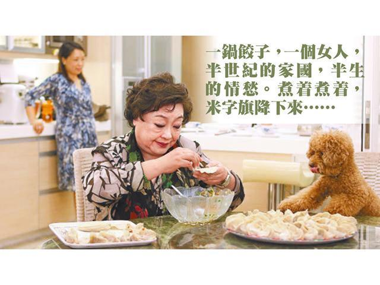

# 餃子皇后 - 陶傑

蘋果日報 果籽 名采 20190214

香港灣仔碼頭餃后逝世。她一九七七年由大陸來香港，原籍山東，不諳英文，只會包餃子，為獨力謀生，最初包一些拿到香港灣仔碼頭去賣，包着賣着，開了自己的小店，然後美資入股，然後生意做大，捐款中文大學，變成慈善家。  

英治時代一個很乾淨的移民奮鬥傳奇。一九七七年是何年份？「四人幫」覆滅，大陸文藝界在傷痕中蠢蠢然復甦，過一年就恢復全國高考，華國鋒主政，西方音樂開始重現：「溜冰圓舞曲」、「藍色的多瑙河」，約莫在這一年底開始在京廣鐵路的車廂裏廣播。百廢待舉，然而雖劫後餘生，總有人感到，這個地方不值得用餘生再賭一場了，輸不起的。於是，她是穿白襯衫灰褲子提着一隻皮箱走過羅湖橋千百人其中的一位。  

是如何向工作單位申請得單程證的，當中又經過幾張提着印把子不堪入目的幹部面孔，這一切均湮不可考。只狐疑那一刻，她邁步走過橋頭，告別了身後那一大片帶着血絲的翠嶺青田，看到眼前這一頭，一片幻虹迷綠的資本主義燈火，她深呼吸，是不是像巴爾扎克的「高老頭」男主角青年拉斯塔納克，在一場葬禮之後，登上巴黎的小山丘，也是俯看那片浮生若夢的繁燈流火，對蒼生、也對自己說：「巴黎，我來了。」  

還是什麼也沒有想。對於離鄉的中國人，浪漫主義永遠是奢侈的。她用一雙手，一根棍子，一包包雪花般的麵粉，把自己的人生重新搓磨開、擀起來，每當她案前抹汗水，若法國畫家米勒窺見，在拾穗的農婦之外，必怦然讚嘆：這是一個純樸的中國婦女最美的時刻。  

她將齊魯古老的麵食帶來南國這個海島的碼頭：一抹獅山之翠，一泓維港之碧，言語不通的香港粵籍食客圍上來，她不知有無想起煙台和青島之間的層層青山，還有從濰坊遙遙吹來，一絲半紙的三兩隻彩鳶？餃淨如心，鍋大似海，山海都落在一籠籠蒸煙之外。鐵道游擊隊之後又徐蚌會戰，人民公社而後忠字舞，香港人買她的餃子，接過錢，她遞上餃子，一笑言謝，卻將許多葱拌肉餡般的往事藏在心頭。  

他們永遠不會明白的，這些香港人。一鍋餃子，一個女人，半世紀的家國，半生的情愁。煮着煮着，米字旗降下來，後來終上了岸，風光不必操勞，雖然店開得多，餃子味道也不一樣了。  

然而人生莫不如是？她離開人世那一夜，我猶獨自行經她當年賣餃子的地方，只見海港依舊，樓廈迷濛，煙籠幻海，她不在了，人間何世，連同不再的灣仔碼頭。 

------

原网址: [访问](https://hk.lifestyle.appledaily.com/lifestyle/columnist/%E9%99%B6%E5%82%91/daily/article/20190214/20612146)

创建于: 2019-02-14 23:01:28