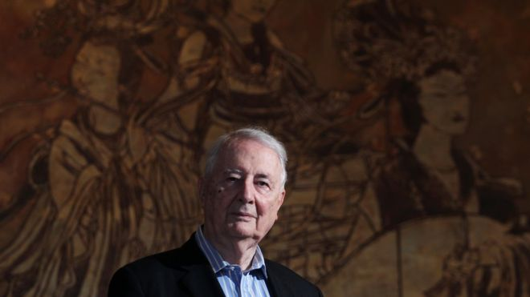
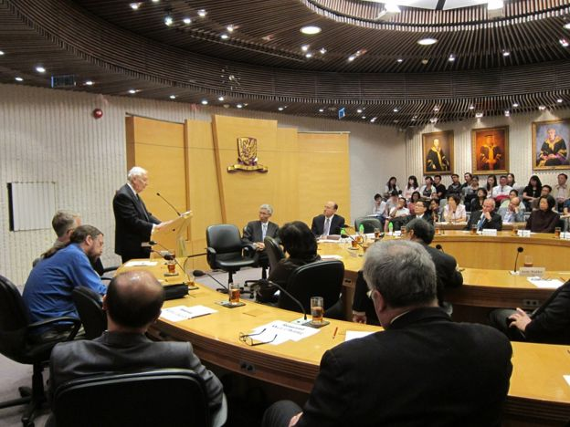
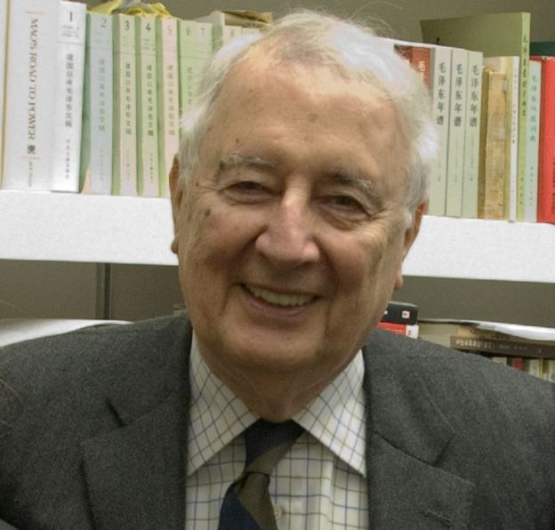
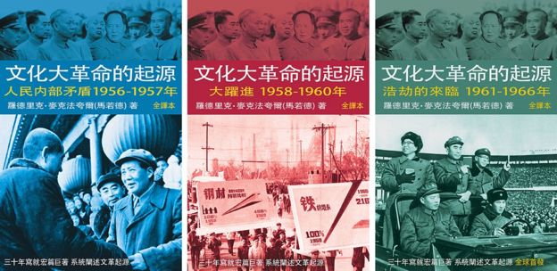

# 麦克法夸尔：读懂文革的哈佛“中国通” - BBC News 中文

鲍朴 香港新世纪出版社出版人

2019年 2月 13日

 
图片版权 Getty Images 

1960年，麦克法夸尔教授参与创建了《中国季刊》（The China Quarterly）并任创始编辑。

2019年2月10日，国际著名的中国问题专家罗德里克·麦克法夸尔教授（Roderick MacFarquhar中文名：马若德）与世长辞，享年88岁。身后留下遗孀芮泰来（Dalena Wright）以及儿子罗里（Rory MacFarquhar）、女儿拉里萨（Larissa MacFarquhar）和两个孙辈。

麦克法夸尔教授生前是美国哈佛大学历史与政治学莱劳伊·B·威廉士讲座教授，费正清中国研究中心前主任，具有丰富的研究及教学经历，包括历任：哥伦比亚大学伍德罗·威尔逊国际学者中心（Woodrow Wilson International Center for Scholars）研究院、美国人文与科学院（American Academy of Arts and Sciences）和皇家国际事务研究所（The Royal Institute of International Affairs）的研究员。

## 读懂文革的哈佛"中国通"

1960年，麦克法夸尔教授参与创建了《中国季刊》（The China Quarterly）并任创始编辑，迄今该刊早已成为国际一流学术刊物，研究当代中国的不可或缺的平台。

麦克法夸尔教授对当代中国持之以恒的兴趣成为他学术生涯的中心，而使他脱颖而出成为一代学人翘楚的，是他一贯坚持的用厘清高层政治的脉络来揭示当代中国社会的研究方法。

1974年麦氏发表英文版《文化大革命的起源》第一卷时，文革尚未结束，中国大陆尚在全民性的动荡之中，他已将1966年开始的文革灾难的起源回溯到动荡的1956年。而当时他所依靠的所有关于中国的材料，主要来自于官方媒体。

坚持不懈地记录高层政治的蛛丝马迹，凭借其深刻的洞察力去厘清脉络，麦氏观察到中共领袖毛泽东独有的在和平时期“继续革命”的思想，几乎不被所有的前期革命同僚所真心拥护，是毛征服每一个同僚逼迫其服从的过程，最终导致一场巨大的全民性悲剧。

为此麦克法夸尔教授奠定了毛泽东时代研究的基础，在这一领域达到了前无古人，甚至后无来者的深度和广度。他花了三十年时间完成的宏篇巨著《文化大革命的起源》三卷本，在历史著作中，堪称当代的《罗马帝国衰亡史》。

麦克法夸尔教授给自己起过一个中文名，叫马若德。1980年代当《文化大革命的起源》第一卷在中国大陆被翻译出版时，译者及出版方并没有事先与之沟通，著作署名“罗德里克·麦克法夸尔”，该书发行几十万册的巨大成功，使中国人记住了“麦克法夸尔”之名，而非“马若德”。

麦克法夸尔不仅是一位伟大的学者，也是一位好的老师。哈佛大学本科生在选学麦氏的文化大革命课程时，被要求在课堂上齐声竭力高呼“毛主席万岁！”。这些美国学生中的许多人都毕生记得这段经历，这让他们亲身感受到群情激奋的场面是如何影响到自身情绪的。

 

图片版权 香港新世纪出版社 

Image caption 《文化大革命的起源》三卷中文全译版发行活动期间，麦克法夸尔教授在香港中文大学祖尧堂讲话，2012年

- [专访：鲍朴谈赵紫阳回忆录出版](http://news.bbc.co.uk/chinese/simp/hi/newsid_8050000/newsid_8051700/8051767.stm)
- [改革开放40年：邓小平究竟给今日中国留下什么](https://www.bbc.com/zhongwen/simp/chinese-news-46512070)
- [2018香港书展：寒蝉效应下被萎缩的自由出版市场](https://www.bbc.com/zhongwen/simp/chinese-news-44920323)

## 十年忘年交

麦克法夸尔教授的去世让我无比抱憾，因为我们的友谊仅是在他生命的最后十年，如此之短暂。

2008年秋，我腋下夹着一本尚未出版的赵紫阳录音手稿，计划在“六四”20周年之际出版，麦克法夸尔教授是最好的将为该书内容介绍给英文读者的人选。费正清研究中心的图书馆馆长南希（Nancy Hearst）在把我介绍给他之前便警告我道： “他的做派会让不了解他的人望而生畏，不要介意，这只是他的外表。”

当南希把我带到他的办公室时，他已站在办公桌前。我还没来得及拿出准备的材料，他便突然开口“为什么选我来写这个？”看来南希是对的，他开门见山，一语中的，一点客套都没有，“有很多学者比我更了解细节，黎安友（Andrew Nathan）参与了《天安门文件》的研究，傅士卓（Joseph Fewsmith）对中国改革年代的每一个细节都了如指掌……都比我了解得多。”

我向他表明了原因：“我相信，一个对文化大革命有深刻理解的人，最有可能真正地理解在中共体制下推动改革的赵紫阳。”

他停顿了一下，说：“在我的印象里，赵紫阳只是一个邓小平的帮手。这个做标题倒是蛮好：《赵紫阳——邓小平的小兵》”，听了这话，我的有点难耐不住，心一沉觉得此人先入为主到了极点了。

“但如果我能看到相反的证据，我很乐意改变主意。”他最后说道。充满了疑虑和不安，最终我临走时还是把手稿留给了他。

我们就这样开始了那以后十年的亲密友谊。

几个月后，我把教授的序言翻译成中文，拿给赵紫阳的一个儿子看。令我始料不及的是，麦氏那篇措辞冷静精准的文字却让他情不自禁地泪如泉涌。但我能够了解，多少谗言、偏见、误解，以及被从历史上抹去之后，最终竟有人真正理解了他的父亲。

赵紫阳《改革历程》的成功出版，在很大程度上要归功于麦克法夸尔教授的序言，但对这位教授来说，这只是他本已光辉夺目的职业生涯的一个注脚而已。

1930年12月2日，罗德里克·麦克法夸尔出生于拉合尔（Lahore），当时属于英属印度（现在巴基斯坦境内）。其父苏格兰人亚历山大·麦克法夸尔爵士（Sir Alexander MacFarquhar）是英统时期的行政官员，其爵士（Sir）的头衔，是通过辛勤工作的得到的嘉奖，既不属贵族阶层，更不能传给下一代。罗德里克·麦克法夸尔并非中文界广泛传说的“出身于贵族家庭”。

在英属印度的童年给了他终生难忘的印象，他学了一口流利的印地语，正统的教育竟然给了他流行英国上流社会的口音。以至于他到爱丁堡费蒂斯公学（Fettes College）上学时，给人颇佳印象，老师称他是个具有“优雅口音”的聪明小伙子。

1953年，他从牛津大学基布尔学院（Keble College）毕业，获哲学、政治和经济学学士学位。1955年，他获得哈佛大学远东地区研究硕士学位。

 
图片版权 香港新世纪出版社 

2009年的罗德里克·麦克法夸尔

记者是他的第一份职业。1955年至1961年，他为英国《每日电讯报》（Daily Telegraph）和《星期日电讯报》（Sunday Telegraph）撰稿。1963年至1965年，他是BBC《广角镜》（Panorama）电视栏目的记者。

“当时有很多记者和学者都在研究苏联，其中不乏成名之士。但研究中国的还很少。”多年后，麦氏告诉我。1953年3月，一度权倾一时的高岗突然从中共最高层神秘陨落，引起了麦克法夸尔的极大兴趣。高岗案是其后毕生心血倾注在中国问题之上的职业生涯的缘起。

麦氏的非贵族出身，同他一生奉行的政治观点是一致的：中间偏左，主要接近工党。1965年后，他试图从政，但成就不大。在1966年和1968年两次竞选议会席位失利后，麦克法夸尔在1974年的大选中，终于为工党赢得了代表贝尔珀（Belper）选区的议员席位。但1979年，玛格丽特·撒切尔（Margaret Thatcher）领导的保守党取得决定性的胜利，使他的政治生涯几近终结。1983年，麦氏再次竞选失败。

“作为没有祖传财富的工党议员，如果你输了，只有去找份工作，很多人都去教书。”他曾半开玩笑地谈到自己如何最终走入学术界。事实上，历史中从来不乏渴望从政，却从未得到机会的人，其中不乏思想伟人：孔子、马基雅维利（Machiavelli）和马克斯·韦伯（Max Weber）。

对我们来说幸运的是，罗德里克·麦克法夸尔得以开始他构建理论、记录历史和从事教学，与人们分享政治深刻洞见的学术生涯。

 
图片版权 香港新世纪出版社 

《文化大革命的起源》三卷中文全译版

去年夏天，我们夫妻俩一同去他位于新罕布什尔州的家中拜访，不想成为同麦克法夸尔所见的最后一面。

麦氏在新罕布什尔州房子被花园环绕，花园是他已故的太太艾米丽（Emily）亲手设计，由现在的太太芮泰来（Dalena Wright）继续打理。一个宽敞通风的客厅，木地板则吱吱作响。一个由粮仓改建的私人图书馆令人印象深刻，即使如此，每个房间依然可以找到书。一座挂钟报时的声音模拟伦敦的大本钟。这是麦克法夸尔家族的圣地。

早上，我从客房走下来，走进新装修的厨房时，麦克法夸尔已经在准备早餐了。

“我能帮做什么？”我问。

“你不要做。”

“为什么不？”

“因为你是客人。”

看着他慢吞吞地、不停地搅着炒鸡蛋，不断地往里加奶油，他称这是法式炒蛋，谈话又重回前一天晚上的话题——1956年的赫鲁晓夫批判斯大林的“秘密报告”。

“我们都同意这个报告标志着全球共产运动衰落的开始，但我还是不明白为什么。赫鲁晓夫纠正斯大林的错误不是做了件好事吗？”我问。

“稍等一下，还要点奶油。”麦氏从身后的大冰箱里拿出奶油，又回来继续慢吞吞地搅拌。

“原因是苏联政权只是‘领袖优先’，仅此而已。”

“嗯，有意思！”他随意的言谈之间，寥寥数语揭示了列宁主义国家体制的本质：国家的力量，大多来自于对领袖人物的绝对忠诚，也就是领袖调动一切社会资源的能力。

我从台面上的一堆空酒瓶中，拿起一个标签上写着“Pétrus 1961”的空酒瓶，问道：“在你教过的所有学生中，谁是你最喜欢的？”

“就算我有，我也不会告诉你！”他笑了，“但是我可以告诉你关于那瓶酒的故事。”

“当艾米丽去世后，我突然意识到生命是多么短暂。我把孩子们一个个叫过来，大家一起把我收藏的所有最好的酒，都打开喝掉。只有活的时候才能享受生活。这瓶酒（他指了指我手里的酒瓶）是我1960年代末参观佩楚酒庄（Château Pétrus）时买的。我付钱买了一瓶1960年的，回来后我打开一看，发现竟是1961年的，1961是个最好的年份，我付不起的年份。”

“嗯？是有人拿错了吧？1961年的酒架和1960年的紧挨着吧？”我笑了。

麦氏道：“我宁愿相信是人家有意对我好。”

罗德里克·麦克法夸尔教授是一位卓尔不群的人物，他身后留下的雍容大度和优雅的光芒将继续照耀那些认识他的人道路，他的智慧是中国人和全世界人的永远遗产。

## 关于本文

_此文由__BBC__中文邀请外部人士撰写。_

*鲍朴是香港新世纪出版社出版人，该社2012年出版了麦克法夸尔教授的《文化大革命的起源》三卷本中文版，其中第三卷为该社全球首发。*

------

原网址: [访问](https://www.bbc.com/zhongwen/simp/chinese-news-47223298)

创建于: 2019-02-1515:38:59

