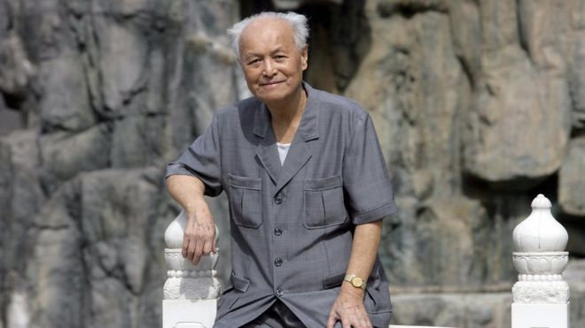
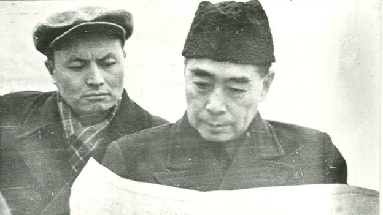
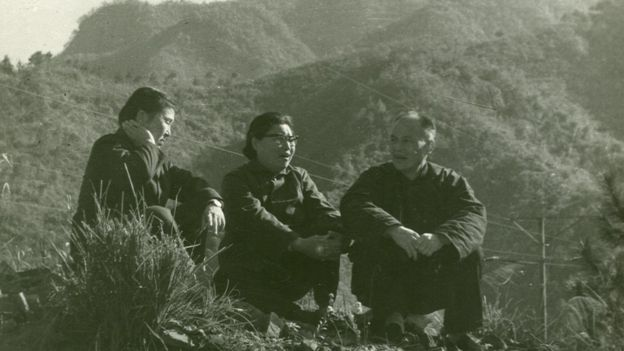
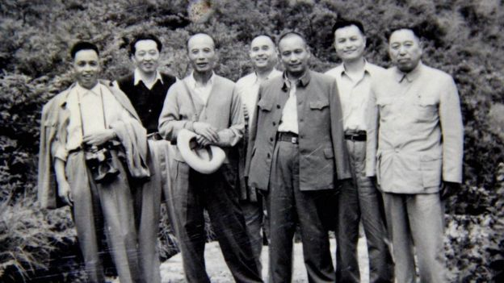
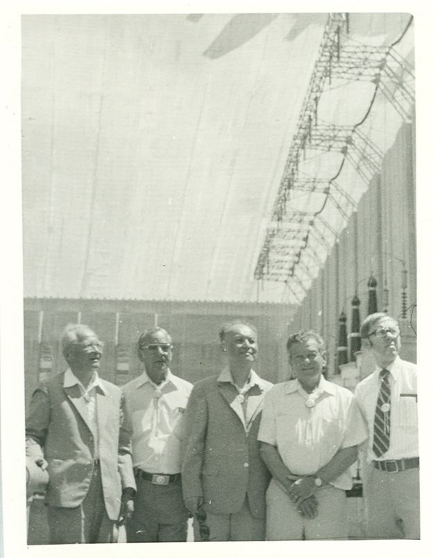
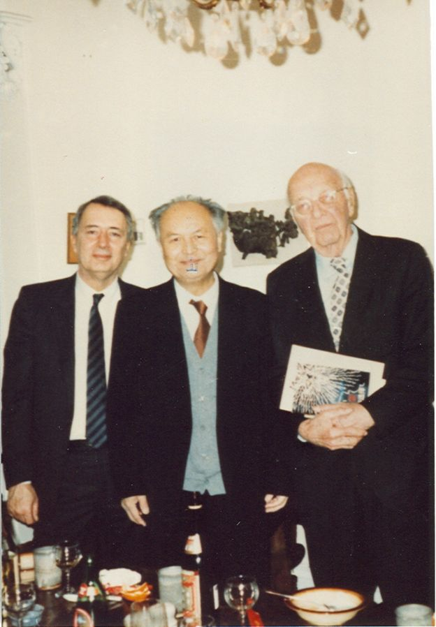
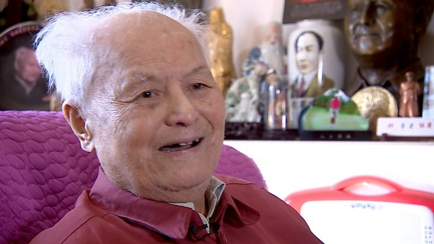
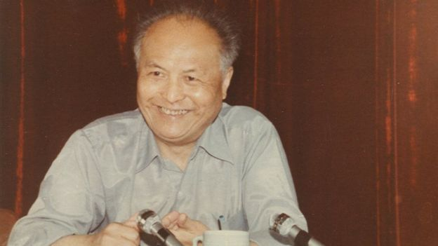

# 李锐：呼吁宪政的“两头真”中共改革派旗帜 - BBC News 中文

苒苒 BBC中文记者

2019年2月16日

 
图片版权 Getty Images 

加入中国共产党八十余载，李锐也没能等来党兑现民主宪政的承诺。

李锐的女儿李南央周六（2月16日）早上确认，当日早晨8点32分，父亲在北京去世，享年101岁。

李南央周六接受BBC中文访问时说，李锐把其从1935年到2018年3月26日（住院前）的所有日记原件都捐献了出来，在美国的胡佛战争、革命与和平研究所（The Hoover Institution on War, Revolution, and Peace）永久保存，并将在几个月内向大众公开。“他所有的日记，我和我先生用了十几年的时间整理，恰恰就在几天前刚刚录入完了，”李南央说到这里一度哽咽。

李南央说，除了父亲的日记、信件，捐献的资料还包括他的书《龙胆紫集》，以及他在庐山会议时期、参加土改时的工作笔记，录入的内容大概有一千多万字，“这些大概就是我父亲留下的最有历史价值的、可以帮助后人的东西”。

她觉得很幸运，最后给这些有价值的历史资料找到了很好的归宿。“在这么多年里我和我父亲像做地下工作一样，一点一点把他们都带了出来。”

 
图片版权 Li Nanyang 

1958年3月，李锐陪同周恩来查勘三峡坝址

李锐是“一二·九”运动前后加入共产党、要求抗日救国的青年之一，是以敢言闻名的中共改革派人士。他曾身居高位，说服毛泽东推迟三峡工程上马，组建后备干部“第三梯队”；也与许多其他中共高官一样，在数次政治斗争、高层博弈中身陷囹圄，起起落落。

退休后，他著书立作成为党史和毛泽东研究专家，建言献策希望推动中国宪政，却不料时移世易，对于他追随一生的党来说，自己悄然变成了“敏感人物”。

- [《走出毛泽东的阴影》：不应被遗忘的那些年](https://www.bbc.com/zhongwen/simp/chinese-news-45093830)
- [英媒：习近平“皇权”在握锋芒盖过毛泽东](https://www.bbc.com/zhongwen/simp/press-review-41737020)
- [“好皇帝”、“坏皇帝” 福山如何看中国修宪](https://www.bbc.com/zhongwen/simp/chinese-news-43276770)

## “何时宪政大开张”

李锐一直念念不忘的是中国的民主宪政。88岁米寿时，他作了一句诗，“唯一忧心天下事，何时宪政大开张”。他的媒体采访和所有出版物，无不是按照这句话在呼吁和行动。

“过去党内历次的政治运动，没有让他折腰，”与李锐相识多年的历史学者施滨海对BBC中文说，李锐性格直率、敢言，“有很多人经历过很多次运动学得很乖了，不讲话了、保持沉默了，他始终没有，所以这几年不断看到他的言论或者出版物。”

即使已到百岁高龄，他仍然数次向党内高层递交建言书，呼吁改革，呼吁尊重宪法、实施宪政，开放言论自由、新闻自由和出版自由。

近些年，他也会接受媒体采访，表达自己对时事的看法。一名采访过他的记者用两个“特别”来形容李锐，“精力特别好，说话声音特别大，完全不像100多岁的老人”。

2018年，两会投票表决宪法修正案草案，要删除对国家主席的任期限制，他对媒体评论说，“习近平要搞终身制”。甚至去年4月17日他101岁生日当天，即使不久前刚因为呼吸道感染昏迷，当天还住院观察插着鼻饲管，他跟朋友和记者聊天时仍然语惊四座。

“（我跟）习近平最后一次接触是什么地方什么时候呢？他当浙江省委书记的时候。过去我也不知道，他的文化程度那么低，”在美国之音曝光的影片中，他这样评价中国现任国家主席。

 
图片版权 Li Nanyang 

1975年11月，李锐的两个姐姐到磨子谭看望刚出秦城监狱的李锐

这位党龄80余年的老党员，中共的元老级人物近年来自己却成了中国官方封杀的对象。最近十几年，他的书在中国内地出版屡次受阻，甚至曾经出版过的书也不允许再版；他的访谈基本上只在香港媒体和外国媒体出现；他还说，中组部的老干局和办公厅也会找他谈话，批评他的文章和讲话。

“从50年代、80年代至今两个时期，我一共由中央和各地的出版社公开出版了十七本着作和选集四种，第十八本《李锐近作》却只能由香港出版了，”李锐曾在其书中序言感叹。

在香港出版的有关李锐的书也遭到中国当局的审查。2013年10月，李南央从美国回中国探亲，中国海关扣查了她行李中50多本其编著的《李锐口述往事》，称这本书不能进中国内地。李南央随后起诉北京海关，“李锐是共产党的元老，如果他都没有言论自由，谁还有？”

## 深刻反思

仕途经过几次大起大落的李锐亲身经历党内高层斗争的凶险和残酷，让他对共产党和老领导毛泽东有了深刻的反思。

文革结束、平反复出后，1979年李锐跟随中国能源考察团出访巴西和美国，成为他人生的转折点。李锐的女儿李南央对BBC中文表示，父亲看到美国拔地而起的高楼大厦、超级市场里琳琅满目的商品以及美国普通老百姓富足的生活意识到，“共产党完全错了”。

李锐在日记中写到，在美国他第一次去了超级市场，看到超市里“应有尽有，方便之至”。“这次出访，应当讲，对于我们自己一贯自诩的社会主义的优越性，在我脑子里面是没有了；不单是水电，而是从整个的社会生活和制度来讲，人家的资本主义更符合人类发展的规律，”李锐在他的口述回忆书中说。

1989年的“六四事件”让他对共产党更加失望。李锐对女儿说，这个党没有味道了，这个国家没有味道了，你能走就带着女儿走吧。

但是“六四”之后，李锐仍然留在党内，同时孜孜不倦地给国家领导人写信，接受媒体采访，呼吁民主宪政。李南央曾开玩笑地问父亲，你是不是舍不得你的车、你的房、你的医疗待遇？

 
图片版权 Li Nanyang 

1958年7月，李锐（右二）在庐山会议

- [毛泽东逝世周年：崇毛为习近平带来难题](https://www.bbc.com/zhongwen/simp/chinese-news-41209600)
- [毛泽东对当今中国意味着什么？](https://www.bbc.com/zhongwen/simp/indepth/2013/12/131216_mao_rittenberg)
- [苏联档案解密（上）：还原真实的毛泽东](https://www.bbc.com/zhongwen/simp/china/2015/07/150706_pantsov_mao_zedong_archive_1)
- [苏联档案解密（下）：还原真实的毛泽东](https://www.bbc.com/zhongwen/simp/china/2015/07/150707_pantsov_mao_zedong_archive2)

李锐回答女儿，不是。“他认为不退党，留在党内说话更有分量，”李南央说。

其实李锐的思想早在延安时就起了变化。最初投奔共产党是为了救亡，为了民主，但是延安的实际情况，包括在抢救运动中被严刑逼供等经历，并不符合他的预期。不过，在生命的后半段，李锐回忆起入党，仍认为自己当年做了正确的选择。

“我们看到国民党不抗战，看到国民党不民主，才加入共产党，”李南央转述父亲的话，“我们参加了共产党，共产党搞到今天这个样子，我们有责任。”

在李南央看来，父亲对共产党能够有那样的反思已经很不容易，但仍期待他能对自己作为共产党的一员曾经犯过的“左”的错误有所反思。因为她从父亲的日记里看到，他在土改和“三反五反”时都曾有过“左”的作为。

李锐晚年曾多次说过，“人生在世，任何人都要受这四种限制：时代、知识、思想能力、个人品德。”李南央认为，父亲也不例外，不是一个完人。

“我父亲的不容易在于他在那个体制内保持了独立的人格，为此一生倍受苦难和挫折而至死不移；父亲的缺憾也是因为他身在那个体制内，所以有着很深的‘党文化’的烙印，”李南央说。

 
图片版权 Li Nanyang 

1979年，李锐（左三）出访美国

## 受毛重用与三次受难

李锐出生于1917年，他的父亲曾追随孙中山，是早期同盟会会员，参加过辛亥革命。少年李锐在湖南度过了整个少年时期，他痛恨国民党的腐败和蒋介石的独裁统治，加上受到左翼书刊的耳濡目染，逐渐向共产党靠近。进入武汉大学就读后，他频繁参加和组织学生运动，并在1937年正式入党。

从参加革命到中华人民共和国成立，他先后涉足新闻和水电工作。1958年，因为极力反对建设三峡，李锐走入了毛泽东的视线。那年年初的南宁会议，李锐与三峡赞成派水利学者林一山在毛泽东面前进行了一场“御前辩论”，陈述三峡工程上马的利弊，还各写了一篇文章呈交。

在李锐意料之外的是，毛泽东不但采纳了他的意见搁置了三峡工程，自己未足半小时的发言和文章还让他获得了毛的赏识和重用。散会之前，毛对李锐说：“你文章写得好，你当我的秘书。”

对于党内的其他人来说，被毛钦点大概是“中了状元”一般的好事，但李锐却并不想接手这份工作。他在回忆录中说，好友、毛泽东秘书田家英早就跟他讲过，毛泽东翻手为云，覆手为雨，他怕毛“不好伺候”。

南宁会议后，李锐的仕途走向新高点，但是他在政治上的打击和挫折才刚刚开始。1959年庐山会议，李锐对大跃进的一些做法提出了质疑。他批评“以钢为纲”的口号，指运动中钢的指标超出客观实际。会议后期，李锐被列为“彭德怀反党集团”的追随者，被开除党籍、送往北大荒劳改。

李锐在北大荒几乎被饿死。他在书中回忆，1961年粮食困难时，没有菜，只能将玉米芯磨碎，加一点粮食做成饼子。饿得没办法，在地里捡到一点土豆和野菜也马上生着吃了。

厄运延续到了文革期间。1967年，李锐向中央专案组的调查人员揭发陈伯达，被抓进秦城监狱，关入单人牢房。从1959年到1979年，人生中宝贵的20年时光，他几乎完全荒废。

 
图片版权 Li Nanyang 

1989年，李锐在美国政治学者麦克法夸尔（左一）家中与美国汉学家费正清（右一）合影

- [读懂文革的哈佛“中国通”麦克法夸尔](https://www.bbc.com/zhongwen/simp/chinese-news-47223298)

其实早在1943年，李锐就在延安经历过“抢救运动”，那是他的第一次“受难”。当时，李锐的武大同学魏泽被逼供时承认自己是特务，供出李锐，说李是他的上级。李锐被关入延安保卫处“监狱”一年多。受刑逼供是常事，比如不让睡觉，眼睛都不准眨。

## 为历史作证

也许是由于乐观的天性和不俗的毅力，李锐在三次受难之后仍然活了下来，政治生命也没有终止。文革结束平反后，他被任命为中组部常务副部长，负责清理省部级班子，选拔后备干部“第三梯队”。

退休后，李锐将更多的精力投向了对中共党史的记述。作为中国革命的参与者和历次运动的见证者，他先后完成了《庐山会议实录》和共19大卷、耗时12年的《中国共产党组织史资料》（中央卷）。他还曾担任自由派杂志《炎黄春秋》的编委与顾问，这本杂志被认为代表党内自由主义势力，多次刊登涉及中共历史敏感事件的文章。

百岁老人李锐的传奇故事

“他最大的贡献，是为20世纪的中国作证。若无他的一系列作证文字，绝大多数的国人会更加迷糊，”香港科技大学社会科学部教授丁学良对BBC中文表示。

在历史学者们的眼中，李锐撰写的一些回顾党内重大事件的书籍都有珍贵的史料价值，如《庐山会议实录》和《大跃进亲历记》。作为庐山会议的亲历者，他写的《庐山会议实录》一书详尽记录了这次党内重要会议的全过程，以及毛泽东、周恩来、朱德、彭德怀等党内领导的发言记录，是海内外研究庐山会议的权威史料。

华东师范大学历史系教授韩钢对BBC中文说，《庐山会议实录》一书，有连官方档案里都缺失的中共常委会议记录，“没有任何一个庐山会议的当事人，对于这样一个重大事件，做出了像他这样系统的，又有大量文献支撑、也有自己记忆支撑的作品。”

回忆过往、书写历史，无非是为了能让今天的中国记住过去发生的事情，以史为鉴。

 
图片版权 Li Nanyang 

1984年，李锐出席北京的一次会议

施滨海说，李锐一直以来的希望就是共产党选择民主走向宪政，这样国家和民族付出的代价会少一点，不会造成天下大乱，“就像台湾那样，他对蒋经国是很赞赏的”。

而最近几年，李锐看到文革回潮的迹象，再加上八十年代形成的共识，如党政分开、不能以党代政等被破坏，他越来越不乐观，开始觉得靠党来完成转型是不大可能的事情。

那中国的宪政呢？施滨海说，“他几次表示过，他是看不到了”。

**_注：_****_文中受访者施滨海于2018年12月意外身故，BBC中文曾在2018年4月数次采访施滨海，在此一并致谢悼念_****_。_**

**_BBC中文记者斯影对此文亦有贡献。_**

------

原网址: [访问](https://www.bbc.com/zhongwen/simp/chinese-news-45990784)

创建于: 2019-02-16 15:48:57