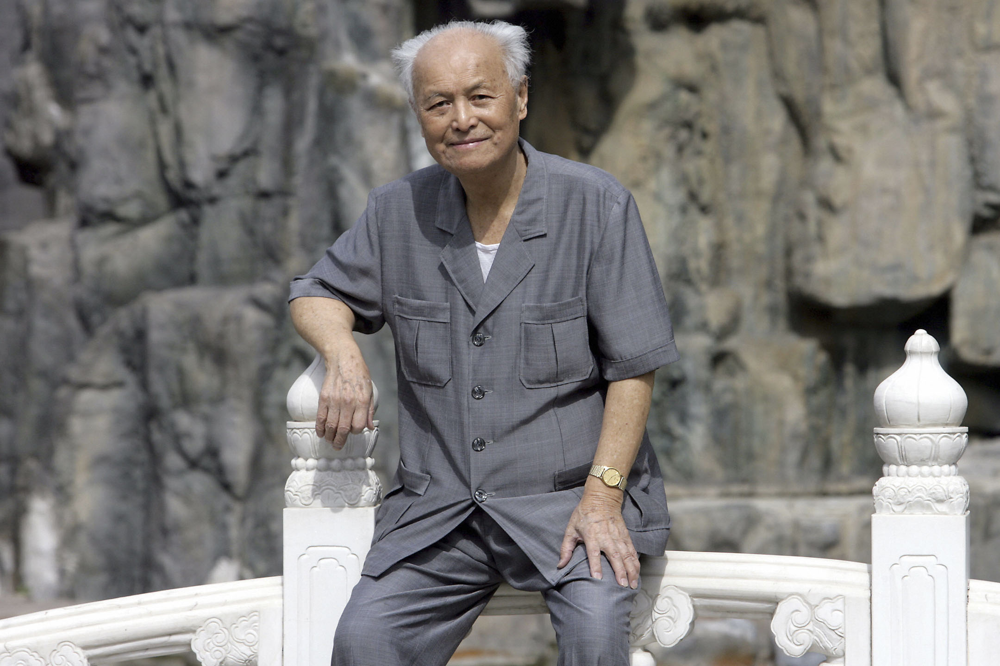
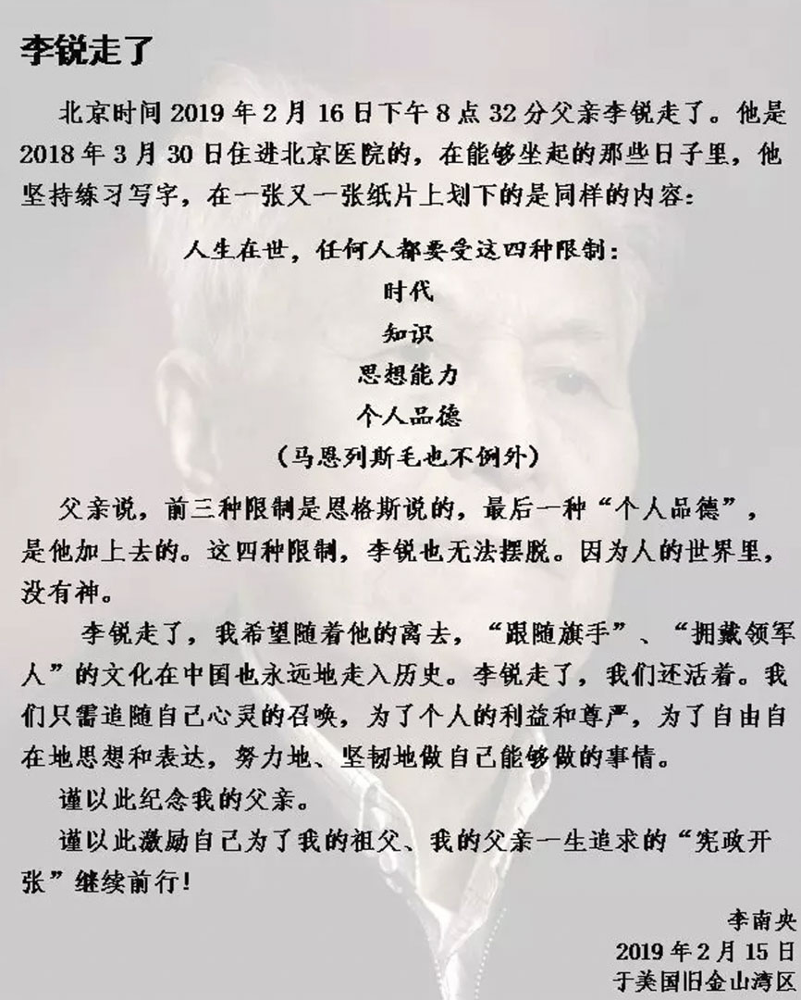

# 中共元老李鋭逝世：唯一憂心天下事，何時憲政大開張 - 端傳媒

「我希望隨着他的離去，『跟隨旗手』、『擁戴領軍人』的文化在中國也永遠地走入歷史。」

2019-02-16

------

2019年2月16日，中共已故領導人毛澤東的前秘書李銳在北京逝世，享年101歲。攝：Goh Chai Hin/AFP/Getty Images

中共元老、曾任毛澤東秘書的李鋭，於2月16日早晨8點32分逝世，享年101歲。李鋭的女兒李南央在訃聞中激勵自己，為祖父和父親一生追求的「憲政開張」繼續前行。

出生於1917年的李銳，終其一生都是以敢言聞名的中共民主人士。直到晚年著書立說不綴，為中共黨史和毛澤東研究留下重要的歷史材料，並以中共黨員的身份，公開提倡民主憲政。但是這位曾被毛澤東誇為「紅旗幹部」，一生在政治漩渦中轉圈的老黨員，也因此成為新時代的「敏感人物」。16日下午，李南央發布的訃聞已經在微信、微博上被接連刪除。

李南央發布父親李銳的死訊。網上圖片

他在1937年加入中國共產黨。入黨前，在武漢大學就讀時期，李鋭就積極參加過「一二·九」等抗日救國學生運動。他曾身居高位，先後擔任過高崗、陳雲、毛澤東等中共領導人的秘書，也曾在廬山會議和文革期間數次遭到迫害，身陷囹圄。

1958年，因為極力反對建設三峽，李鋭的辯論和文章獲得毛澤東的賞識。毛澤東不僅採納他的意見擱置了三峽工程，還欽點他擔任自己的秘書。但李鋭並不情願，他在回憶錄中寫道，自己聽毛的另一位秘書田家英講過，毛澤東翻手為雲，覆手為雨，怕毛「不好伺候」。

李鋭的日後仕途證實了田家英的判斷。1959年廬山會議，李鋭對大躍進提出了質疑，指出運動中鋼的生產指標超出客觀實際。會議後期，他被列為「彭德懷反黨集團」的追隨者，被開除黨籍、送往北大荒勞改。

1967年，文革期間，李鋭在交代材料中揭發了陳伯達，這種「不合時宜」的行動，讓他被關進秦城監獄。直到1979年才平反，日後先後擔任水利電力部副部長，中共中央組織部常務副部長、青年幹部局局長。

20年的牢獄之災，沒有磨滅李鋭的秉性。李南央回憶，李鋭上任第一天，就有人送來了一份名單，是子弟們應該安排在方方面面的「指令」。李鋭勃然大怒，把名單當着來人扔進抽屜。

> 「我們參加了共產黨，共產黨搞到今天這個樣子，我們有責任。」

1989年，「六四事件」之後，李鋭對李南央說：「這個黨沒有味道了，這個國家沒有味道了，你如果有機會，帶着女兒一起離開吧。」儘管如此，李鋭自己仍然留在黨內，孜孜不倦地給國家領導人寫信，接受媒體採訪，呼籲民主憲政。李鋭告訴女兒：「我們參加了共產黨，共產黨搞到今天這個樣子，我們有責任。」

退休後，李鋭投入了中共黨史的記述工作。他撰寫了《廬山會議實錄》和《大躍進親歷記》等具有史料價值的書籍，並主管了19大卷《中國共產黨組織史資料》的編纂工作。他還擔任了自由派雜誌《炎黃春秋》的編委與顧問。

> 在胡耀邦逝世20週年之際，李鋭在《炎黃春秋》發表文章《不當奴隸，更不當奴才》

2002年，中共十六大小組會上，李鋭做了《關於政治體制改革的意見》的發言，提出廢除黨中央政治局常委任終身制、取締「全黨服從中央」的表述、破除民主黨派和黨外人士只任副職的陳規等建議，並以書面形式送時任國家主席江澤民和中國中央政治局常委。發言稿隨後在《炎黃春秋》上刊登，並得到了中央的稱讚。

第二年，在接受《21世紀環球報導》的訪問時，李鋭提及毛澤東在中共七大講話的未公開內容：「開國以後，掌握政權以後，我們的鬥爭對象就是民主人士了。」同時，他批評鄧小平擺脱不了舊的認識，無法貫徹政治體制改革。《21世紀環球報導》隨後被勒令停刊，坊間認為這和刊登李鋭的專訪有關，但沒有經過官方證實。

2009年，在胡耀邦逝世20週年之際，李鋭在《炎黃春秋》發表文章[《不當奴隸，更不當奴才》](http://news.dwnews.com/global/news/2009-04-15/4853665-3.html)，指出要完成胡耀邦的遺願，不能再走一黨專政的老路。

同年，他和朱厚澤、杜導正等黨內民主人士在香港《爭鳴》雜誌發表給時任國家主席胡錦濤並中共中央政治局常委的公開信，要求擴大輿論監督、保障公民社會、進行整治改革。這被媒體稱為「零九上書」，與劉曉波所組織的「零八憲章」，成為黨內黨外合力推動民主的寫照。

在人生的晚年，李鋭目睹了言論空間的收緊，民主憲政主張在大眾媒體上逐漸失語，乃至噤聲。2014年，國家新聞出版廣電總局發出通知，要求《炎黃春秋》雜誌的主管單位由原來的中華炎黃文化研究會更改為文化部下屬的中國藝術研究院，雜誌編輯部成員憤而辭職。李鋭和一眾黨內民主派老人的發言陣地，就此失落。

不僅如此，在內地公開出版了十七本著作和選集後，第十八本《李鋭近作》也只能輾轉在香港出版。2013年10月，李南央從美國回國探親，行李中50多本《李鋭口述往事》被中國海關扣押。李南央隨後起訴北京海關，「李鋭是共產黨的元老，如果他都沒有言論自由，誰還有？」

在去年101歲生日時，儘管已經身卧病榻，插着鼻胃管，李鋭依然非常犀利。據BBC中文網報導，2018年，兩會投票表決憲法修正案草案，要刪除對國家主席的任期限制，李鋭評論道：「習近平要搞終身制」。他還在另一段採訪中對習近平的文化和思想水平表示失望：「過去我也不知道，他的文化程度那麼低。」

「人生在世，任何人都要受這四種限制：時代，知識，思想能力，個人品德。」在人生最後的日子裏，李鋭一遍一遍地寫下這句話。這位在青年時期因理想主義而加入中國共產黨，終其一生為憲政奔走呼籲的黨內民主派，直到死亡的一刻，也沒能見到政治理想實現的曙光。他在88歲米壽時作的一句詩，或許能概括他極具政治性的一生：「唯一憂心天下事，何時憲政大開張」。

------------

### 評論 12

- yanfang49 分鐘前

  很多人或许已经消磨偏离了认知意志，或许心底知道了却表达、描述不了……任何国家、地区，普罗大众的权利主要都是靠人民群众自己慢慢争取的，西方很多发达国家，宪政民主了那么多年，现在他们还是每个国家社会都有"声音"、"反对"、“斗争”…… 他们早成了所谓的发达国家几百年后还是这样。权利永远是靠我们自己争取的！虽然表现形式、内容和时间不一样。类似“黄背心”的运动一直有，只是它的影响看起来有点大，包含的民粹和社会内容复杂一些而已。作为一个东亚面积大国，从历史到现在国内基本没有民主表达形式和权利争取的延续方式和轨迹，或者说它短短断断续续的有，成为个体事件或只是被当权者掩盖，这是历史也是现实，所以“争取”的方式方法注定有点不一样。一个所谓地现在很强盛的东方强大国，为什么会在2000年后还对周围的一些一般国、小国或穷国，比如在争议国土上，看上去唯唯诺诺，低头求和？很不可思议，也让人诧异。前几年一位香港同胞把一个不是秘密的秘密公开了，就被大陆政府送进了监狱，牛逼地中国口交部宣称的结果就是中国的领土是国家机密，协议内容和划界不能公开。国内外能笑掉大牙吧！另一方面，国内的摄像头监控、网络实名制、保党治安花费不断落实。这样的对比很强烈吧，你也不要觉得窒息，这个是不折不扣地“纸老虎”！一切独裁政权和权力都是很脆弱的，它容不得半点反抗，因为反抗一些动静就能像野火一样把它烧掉！作为一个中国人，你也必须谨慎！如果你有民主、言论、隐私需求，对于互联网和手机一定注意隐私保护！特别提醒微信WeChat、QQ很危险，现在的微信WeChat安卓版老版本全部停用，最近的几个版本很多会自动升级到新版7.0.0，连安装包都有93M，安装等十几分钟轻松超过500M，我一直怀疑它能主动搜索用户手机上的各种资料和信息，我的一个只是上外网的朋友也经历看到过一次。手机是现代人很重要的工具，如果你连这些隐私都主动上交了就成了裸奔者！建议有需要的人又特别担心隐私，最好单独准备一个旧手机使用微信WeChat和QQ等内容，同时不要使用腾讯系其它软件！顺便提一下，手机太大众了，华为手机可能不会在硬件上做后门，但如果觉得个人隐私重要的话，不建议使用华为手机。作为中国人，不管面对的是什么“纸老虎”，还是要注意，普通人做一些小“坏”事不要现真身和留名;如果你是脆弱的公众人物和新闻人士，就应该立足事件、真相本身，这样你们才能走得更远！扯点其它的，贸易战是个好的开端，它不会重伤蛇的七寸，但已经慢慢会动摇它的根基了，对于手无寸铁的普通人而言，明眼的国家政府机器还是很强大。未来再.见，历史可期……

- 戀雨10 小時前

  我可以為了生活低頭不語，莫談國事，因為我沒得選。 但是，我永遠不會為了自己的利益去出賣良知，不會為了自己的職稱，去加入共產黨。  
  人可卑微如塵土，不可扭曲如蛆蟲。

- 发花林氏12 小時前

  專制簡單利落點，不過，領導壓力也大。自由言論，民主憲政，大陸許多人也都期待吧！一切都得付出代價的！

- 时代病人13 小時前

  然后炎黄春秋言论阵地的丧失，应该是2016年吧

- 时代病人13 小時前

  第一次听到李锐先生这个名字的时候模模糊糊的知道他曾经是毛的秘书，是少有的党内的开明派。后来高中大学读《炎黄春秋》，李锐先生位列编委，也时常可以看到他写的文章，作为掌握一手史料的人，他正直敢言，也持续不断地呼吁政治体制改革和宪政。到后来《炎黄春秋》被封，只能从零星的采访中看到李锐先生，还是那么直言不讳，尤其是这两年，更是对有些在位者言辞毫不留情面。李锐先生的去世，一定让有些人松了一口气。从某种程度来说，李锐先生这批党内开明派是一片黑暗的WG结束后的盗火者。愿历史给出一个公正的评价，愿几代人的愿望终有一天能实现，即使我们这一代也看不见光。

- 習大棋14 小時前

  “毛病不改，积恶成习”

- pioneexx14 小時前

  “未来是光明的”，我一直坚信着这句话。  
  但我所见的未来，只有黑暗。那个想要的未来究竟能在什么时候到来，我不清楚，周遭的环境在越变越差，大家却竟然在渐渐开始习惯于其中。  
  国内想要投身于民主运动的人最后还是会越来越少吧。  
  李老走好。

- 月影14 小時前

  李老走好，希望有时间的时候把李老的著作找来拜读一下。

- 热风14 小時前

  两头真

- CountingStars14 小時前

  一路走好。

- 蔣公千古15 小時前

  唯物论告诉我们，事物发展的的道路是曲折的，前途是光明的。  
  他颤抖地在纸上写下  
  “相信未来。”

- 范锵楠15 小時前

  再见李老

------

原网址: [访问](https://theinitium.com/article/20190216-lirei-dead/)

创建于: 2019-02-17 10:48:50