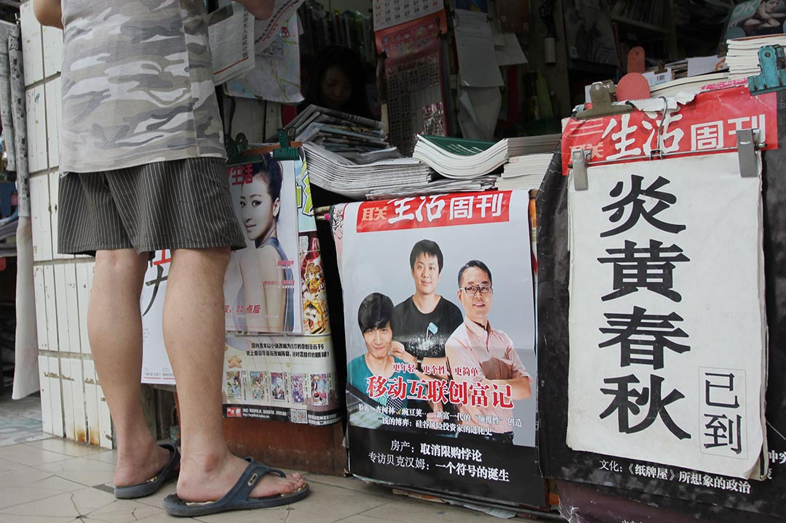

# 1991年，《炎黃春秋》這樣誕生在地下室｜大陸｜端傳媒 Initium Media

一群老頭，三張舊桌，幾間地下室，卒於25歲的《炎黃春秋》，在1991年沉悶的春天，是這樣誕生的……

特約撰稿人 周磨磨 發自北京2016-07-19

------

【編按】2016年7月17日，25歲又16天的《炎黃春秋》，由社長杜導正簽字，宣布即日停刊，以拒絕官方強制對雜誌社高層進行大換血並派人強佔辦公室和官網管理後台。時間倒回25年，走進月壇南街69號的老中青年，赤誠倔強，從一而終。

（本報導採寫於2011年。今日首發）

2014年8月9日，湖北武漢，街頭報亭。炎黃春秋雜誌已到的招貼。攝：Imagine China

1991年春天，部級幹部杜導正離休後琢磨著找點兒事做。他在景山公園西邊租來幾間地下室，從總參「化緣」了三張桌子（上面還殘留著文革大字報），邀七八個老筆桿子湊一起，一份「求是存真，以史為鑑」的歷史刊物──《炎黃春秋》便降生了。

那時候，後來的那些「年輕人」們還四處奔碌著：

楊繼繩，當了半輩子記者，還待在新華社，職稱評完了，混到頭了，他決心不再「跟著形勢跑」了，只「盡可能說真話」，他開始了一場漫長的求索，直至為大饑荒年代餓死的3600萬人豎起一座《墓碑》；

34歲的吳思從《農民日報》離職，辦過幾個雜誌，手臭，辦什麼砸什麼，倒是拼命讀書的習慣存續，在做了上百萬字的讀史筆記後，最終被他悟出一個頗具中國特色的詞彙──「潛規則」；

首都師範大學的青年教師徐慶全在授一門叫敦煌吐魯番出土文書的課，抑鬱得很，不到半學期，班上50個學生只剩下4個，他找不到安身立命的地方，課餘常常弄點花生米和白酒，一邊喝一邊哭。

> 前國家領導人習仲勛曾題字：「《炎黃春秋》辦得不錯」。 106歲的語言學家周有光說：《炎黃春秋》是當代的《新青年》。

20年後。

2011年，北京，月壇南街69號。外面的世界車水馬龍。穿過一棟老字號的國有賓館，在美容院和律師事務所的招牌下，最西頭那矮樓的第二層，就是《炎黃春秋》雜誌社。

七間房，午飯時分一股速凍餃子的味道。一大半辦公桌椅是高校上個世紀淘汰下來的「古董」，甚至還保留了1945年的標籤，櫃子合不攏，靠橡皮筋年深歲久地繃著。沒有飲水機，招待客人還用計劃經濟年代的綠鐵電壺。成摞的書信四處安家，處理的速度永遠趕不上堆積的速度，難免落得一身灰。

望過去，編輯部裏白發茫茫，但都拿自己當「新青年」。社長杜導正87歲，看誰都還是「小字輩」，於是編輯部便有了「小楊」──70歲的副社長楊繼繩，「小吳」──據說苦讀書導致頭髮花白的總編輯吳思，還有當之無愧的「小徐」──49歲的副總編徐慶全。

簡陋如斯的大環境裏，老杜和「年輕人」們勁頭十足，他們討論上下五千年，東風西漸，以及中國往何處去。他們代表著體制內反思人士的聲音，是温和理性的改革派。一路磕磕絆絆過來，如今的印數勇攀至15萬份。擁躉大多是國家退休幹部和老文化人，平均年齡60歲以上。

前國家領導人習仲勛曾題字：「《炎黃春秋》辦得不錯」。 106歲的語言學家周有光說：《炎黃春秋》是當代的《新青年》。

## 杜大膽與小春秋

《炎黃春秋》生於1991年春。隨著詩人和夢想家的時代宣告休止，報刊雜誌的圈子也單調得不行。一些黨內高層的老同志試圖打破清一色的沉悶。於是，上將蕭克站出來，倡議辦一份「不唯上，不唯親，不唯權勢」的歷史雜誌。

上將之外，蕭克的另一身份是作家，曾獲1988年茅盾文學獎。他有句名言：「歷史的事實是最大的權威。」

1990年，蕭克點將，讓剛退休的中國國家新聞出版署署長杜導正擔任社長。

> 「我們沒有向國家要一文錢，一個編制，一間房子，真正是白手起家，」杜導正說。

杜導正常說自己是「黨抱大的娃娃」，14歲入黨，參加抗日戰爭，之後進了新華社，做黨的喉舌。他也歷經了幾次厄難，捱整，整人，再捱整，一度被打為「廣東的小彭德懷」。自此他頭腦冷卻下來了。 1978年，杜導正在新華社任國內部主任，在真理標準討論、平反冤假錯案、包產到戶「三大工程」上沖得厲害，得一諢名「杜大膽」。

老杜這輩子是個「兩頭真」──早年真誠地參加革命打硬仗，中間犯過糊塗，晚年又真誠地反思。他寫過一篇文章，標題叫「講真話真難還是應當講真話」。

「杜大膽」之外，捧場的幾十位顧問和編委也都是重量級人物，「中國農村改革之父」杜潤生，原中共中央宣傳部部長朱厚澤，原中國國家安全部長凌雲……

新雜誌名頭響亮，囊中卻羞澀得很。 「我們沒有向國家要一文錢，一個編制，一間房子，真正是白手起家，」杜導正說。

一開始誰都沒工資，沒經費，老頭子們在這第二職業幹得很帶勁，天天上班，從早到晚駐守編輯部。編輯劉家駒五十多歲，下樓梯把胳膊摔斷了，剛接上，綁著石膏板子就來上班。為了省路費，每天上下班，杜導正就拿他的部級幹部專車當公共汽車使，從萬壽路到宣武門兜一大圈，接送幾個同事。

有人看著都納悶，摘詩贈杜導正，「三十畝地一頭牛，老婆娃娃熱炕頭」。言下之意，你這樣的大幹部，天天盯著小雜誌幹什麼！

1991年，創刊號很快面世。一出門就跟老觀念唱了對台戲。過去講黨史、軍史只提紅一方面軍，《炎黃春秋》寫道，張國燾的紅四方面軍也打了漂亮仗。講共產黨的代表人物，除了李大釗和毛澤東，也有貢獻很大的陳獨秀……

雜誌大賣四萬多冊。

其時，首師大教師徐慶全是杜導正的「忘年交」小朋友，喝得昏天黑地之餘也給雜誌社寫點東西，比如《宋代改革的左中右三派》。後來別人叫他來這兒，他想「這兒敢講點真東西」，二話不說就來了，工資沒談。

## 內容下海，發行上山

新雜誌適逢改革開放年代。 「下海」、「發財」這些詞彙頻頻上報，有報紙說，約三成的北京人做著百萬富翁夢。都市報出現了，廣告越來越吃香。但在《炎黃春秋》，老同志們筆頭上支持經濟體制改革，行動起來卻是矮子。

「我們沒有廣告的概念，舊社會的報刊都是不搞廣告的，文字很珍貴的，篇幅有限，只要能夠運轉就行了，」杜導正說。

老杜任命六十出頭的徐孔擔任雜誌社總經理，分管廣告和發行。徐孔是解放前上的中文系，沒畢業就跑到張家口解放區，跟所有人說：我是來尋找真理的。朝鮮戰爭他是隨軍記者，一度因為替戰友鳴不平，當了二十多年的右派，開除黨籍、軍籍。平反後又拿起了筆，任《農民日報》總編室主任。

老同志徐孔對市場不感冒。當然，賺不賺錢是次要的，管理者老杜更看重他的人​​品──「做不做發行沒所謂，關鍵是絕不會貪污腐敗，雜誌社沒損失嘛。」

很快，在徐總帶領下，雜誌發行工作一團亂麻，資金回籠不靈，理想主義的​​老人家們斯文不起來了。

> 總經理老徐的信念是：內容好了，發行自然就好了，不用專門搞。他成天看稿子，在單位裏看，拿回家也看。連廣告發行部、財務部在內，大夥都爭著看稿子，齊心協力「奪」編輯部的「權」。

有一回拖欠印刷廠3.5萬元許久，對方惱了，差四個拳頭大胳膊粗的壯漢衝進了雜誌社──那時雜誌位於北京圖書館二樓，中南海北門正對面。 「野蠻得跟文化大革命一樣，一屁股坐在辦公桌上，遞杯子給他們喝水，哐的就把杯子砸了，他們拍桌子說粗話，要錢，今天必須給，不給我們就不走！」一群老幹部見機偷偷溜走了。對方不罷休，放話說：我們要住到杜導正家去，吃他家的飯，睡他家的床！當夜就窮追到萬壽路的部長大院門口，每天晚上二十多個恐嚇電話，嚇得理虧的老杜躲著不敢出門。

作為一名總經理，也許徐孔最大的貢獻是人才引進了老部下吳思。當時吳思籌辦《東方雜誌》，被封了，正愁沒地兒去。

吳思1957年生人，生日適逢馬克思誕辰，故名為「思」。 「文革」時停課鬧革命，他被鎖在屋裏帶弟弟，由此養成「亂翻書」的習慣​​。他人生的改變緣於兩次重大轉折。其一是「學大寨」到「大包乾」，先前他下過鄉當知青學大寨，左得很，「抓」到貧下中農截水澆自留地，還跟別人打了一架。但找不到出路的農業同樣讓他困惑。 「分田單幹」的出現，突然間解決了他所有的疑慮，「原來可以這麼幹！思想上的框子馬上砸碎了。」

吳思也研究經濟，他嘗試對放任自流的發行工作提建議。比如調查北京市讀者群分布和報攤位置，之後鋪攤推廣，再不然就用老招子，「到各省去，請郵局啊通訊員吃飯，王婆賣瓜，訂一份給回扣，拉關係，找領導，然後落實」。

老頭子徐孔平時脾氣挺好，一聽要改進發行工作，就拉下瘦長的臉：你們沒幹過，你們不知道，可不像你們想得那麼容易！

每年徵訂季節，交5000元就可以上郵局徵訂目錄，上年紀的徐總經理看不慣這種「歪風邪氣」，不給！寧可不上也不花那5000塊錢。

結果好些讀者想訂《炎黃春秋》都找不著路子。

總經理老徐的信念是：內容好了，發行自然就好了，不用專門搞。他成天看稿子，在單位裏看，拿回家也看。

非但徐孔，連廣告發行部、財務部在內，大夥都爭著看稿子，齊心協力「奪」編輯部的「權」。

## 「節約鬧革命」

那些年，外頭下海的味道頗濃，中國人嚐到了市場經濟的甜頭，而雜誌仍舊窮得叮噹響。

發行部主任孔屏的一項重要工作，是到印刷廠和紙廠撿廢紙和廢繩子，一撿一大車，回頭給讀者包裹書和雜誌，信封都是兩面使。

「節約鬧革命，不浪費，我們這一代人都這樣。」頭髮花白、戴著老花鏡的孔屏一面用N次利用的牛皮紙和繩子包著書，一面頭也不抬地說。這位發行部主任嗓門粗大，都是這些年接電話練出來的，「讀者都是老人，耳朵不好使，聽不見，就得跟他吼」。郵寄書信的稱謂是「同志」，「什麼先生小姐的，聽著難受！」

而「廣告發行部」的辦公室，像極了廢品回收站──撿來的電子秤、掛鐘、鍵盤，還有莫名其妙的老式收音機、長木棍……

「也只有這樣的地方，可以辦出這樣的雜誌。」辦公室主任王海印說。

> 杜導正說，「網絡發展的結果，會在中國的上層建築中引起革命性的變化，這是自下而上的。」

王海印是雜誌社唯一的70後，名銜是辦公室主任，實際上名不副實──他基本沒機會負責接待和吃吃喝喝。吃住都在辦公室，他在十平米的房間裏實現了生活工作一體化，床和辦公桌用一張簾子隔開，精簡得像個膠囊公寓。

平日裏他得擔起一切閒雜事務，比如開門鎖門，打掃衞生，買四十塊一斤的茶葉待客。有時半夜書送到了，他就去馬路邊卸貨，把書搬到大院裏。第二天老人上班了，也一起搬進搬出。

「大家就像一家人，沒有架子，沒有等級。」規章制度倒是有，不過基本上靠自由心證和自律。印像中，九年裏他只捱過一回數落，那次他好些天忙不過來，房間亂成一窩，老杜見不得亂，就幫他把房間清理了一遍。事後大家批評他：怎麼能讓老人家給你擦桌子疊被子呢？

2001年，還是學生的王海印來雜誌應聘，杜導正對他說：「這是一個值得為之奮鬥終身的地方。」月薪800元，他留了下來。

那一年，高層們的工資也才一千出頭。受老領導杜導正之邀，退休的楊繼繩來到《炎黃春秋》雜誌社，咳，連台電腦都沒有！

楊繼繩也是個「兩頭真」。他父親死於大饑荒，臨終前瘦得像一段枯木，其時他還在熱情歌頌「大躍進」。後知後覺的恥辱感迫使他要對那段歷史撥亂反正。於是他寫墓碑，寫改革年代的那些事兒，為此收到過「取下你人頭」的恐嚇短信，他也沒當回事。到《炎黃春秋》當編輯後，他還時不時顯露記者本色，呼籲教育公平，披露北京公務員低價福利分房。

約是2003年，杜導正才在徐慶全口中聽說「網絡」一詞。編輯部向來數「小徐」最潮，開酒吧，搞收藏，還是「蘋果」粉。老杜不懂「網」為何物，聽著特神乎。 「年輕人」就費勁解釋：網絡等於是條大馬路，上頭好多商店，不過店裏擺的不是商品，而是各種各樣的文章。

「一開始以為就是個通訊工具，沒想到網上是個平台，可以對全世界發言，」中國網民突破4億、鰲居世界之首這一年，杜導正說，「網絡發展的結果，會在中國的上層建築中引起革命性的變化，這是自下而上的。」

四年前，雜誌社終於配齊了兼容機和網絡，不過，老杜至今連鼠標都使不來。

## 給温家寶的稿費不能少

「我們這裏基本都不靠工資吃飯，」管理者杜導正看上去一點也不擔心低薪帶來的人才流失。 「楊繼繩寫書，徐慶全講課，吳思沒事還炒點股。」

2003年曾有高校挖吳思，開出的條件優渥：工資翻番，還有幾十萬的安家費。吳思回絕了。老杜心裏樂呵，又不免擔心吳思的生計：「蕭克說過，票子多了沒用，但沒有票子也不行啊！」吳思答：「杜老您放心，我炒股掙了幾十萬呢！」

吳思數字上一點不含糊，他在一堆歷史數據中分析出了「血酬」：一個中國煤礦工人的命價66.27萬，而徐孔當21年「​​右派」的損失是120萬。但私下，他顯然更欣賞蘇東坡的放達，「來炎黃春秋，給不給錢無所謂。」

> 也許惟有死亡，才能打亂雜誌的軌跡。

這是21世紀初，中國人普遍有一張焦慮的面孔。 「圈地運動」伊始，壟斷巨頭浮出水面，政府工作人員消耗的財政收入比例越來越高。 《炎黃春秋》對中國現狀的分析是：擠不進去，你永遠是窮人。

2007年，《炎黃春秋》發表原中國人民大學副校長謝韜的《民主社會主義模式與中國前途》，反響巨大，「在思想界引發的震盪，接近於1978年『實踐是檢驗真理的唯一標準』大討論，」一向低調的吳思有點得意。

這些年，編輯部刊發了一系列大尺度的歷史文章，呈現了開國領導人的複雜性，深入剖析土改、反右、大躍進的機理，甚至披露了大饑荒中的「特種案件」。一大批離退休的高層幹部成為主要作者，包括前國務院副總理田紀雲，原政協副主席胡啟立等。 2010年底，雜誌發表評論文章《上下互動：温總理談話解讀》，末了還給温家寶匯去800元稿費。

幾乎每天都有老年讀者找上門──有的挎著菜籃子路過，有的拄著枴杖來投稿，有的從斜對門的國家信訪局過來上訪──提得最多的是：你們敢說真話！

「工作著是美麗的，」在堆積著灰塵、古籍和速凍餃子的資料室裏，徐慶全開始「詩意地棲居」。

也許惟有死亡，才能打亂雜誌的軌跡。

2010年5月，80歲的總經理徐孔過世。 「尋找真理」的字句成為他的墓誌銘。即便發行部門再無為而治，印數也從最初的四五萬份慢悠悠地漲破了十五萬大關，把一堆摩天大樓裏市場面孔甩在了後頭。

「也許徐總是對的，」有時吳思這樣想。

## 「碎步前進」

有關死亡的話題一直伴隨著《炎黃春秋》。

原廣東省委書記任仲夷曾刊文《任仲夷談鄧小平與廣東的改革開放》，文末提到政治體制改革的兩個方案：一，搞試驗田；二，學習借鑒國外先進的政治文明。長途電話裏他對杜導正說：「這是專門給你們《炎黃春秋》寫的，也可以算作我的『政治遺言』了。」

2005年，任仲夷走了。

1993年4月，胡耀邦逝世四週年，老同志們想著應該有所表示，在封三發表了一首悼念耀邦的白話詩。有人擔心步子邁得有些大。是上將蕭克把風頭頂了下來，他囑咐編輯部：「誰對雜誌有意見叫他打電話給我，把我的電話告訴他。」

2008年，蕭克走了。

曾有新聞界前輩諄諄善誘：「我們不要埋怨限制，做事就跟蓋叫天唱京戲一樣，桌子底下也能跳舞。」

2010年，這位前輩也走了。這一年，版權頁上的顧問編委和社委會名單裏，黑框幾乎就沒有消失過。

常常這樣的時刻，編輯部裏有點沉默。杜導正2010年87歲，也不時被善意提醒，該是含飴弄孫的時候了。不過老杜仍舊硬派：要幹到120歲！

編輯部裏，杜導正以最樂觀的悲觀主義重提孫中山那句話：革命尚未成功，同志仍需努力！

杜導正愛用「碎步前進」來形容中國現階段的發展：「現在是進三步，退兩步，左一下，右一下，跟扭秧歌似的。我們就是看得著急，希望進步快些，再快些。」

2011年5月裏的某日。這些天，中國的關鍵詞是：三峽與大旱，人大代表自由參選以及炸毀了江西省撫州市臨川區行政中心西樓的十年上訪老戶錢明奇。

月壇南街69號。上午不到九點，新任總經理李晨──前《人民日報》社長李莊的女兒──就來燒開水灌水壺了。

老杜在家，原則上兩個星期來一趟辦公室，可在家也不閒著，總有世界各地的記者排著檔期求採訪。吳思步行上班，開了電腦，正在讀《人民日報》幾天前的署名文章，《共產黨員絕不允許在重大政治問題上說三道四》。不一會兒楊繼繩也來了，八十​​年代的小幹部形象，皮帶系在肚皮上，昂首闊步邁進辦公室。徐慶全缺席，受邀去山東給大學生上歷史政治課去了。

很快「同志」們的來電響起，粗且大的嗓門喊起，投稿的上訪的老人家顫巍巍踱上樓來，碎步前進的又一天開始了。

### 《炎黃春秋》雜誌社「換血」風波

以敢言著稱的改革派雜誌《炎黃春秋》，7月11日剛剛通過微信公眾號發布創刊25週年紀念文章，即陷入連串風波。7月14日，雜誌社發表聲明，稱主管主辦單位中國藝術研究院在7月13日通知雜誌社，該院與雜誌社在2014年12月18日簽訂的協議自動失效。這份協議約定，雜誌社有人事任命權、財務自主權和發稿自主權。對於研究院的通知，雜誌社表示不同意，並委託律師起訴研究院。聲明還指，研究院派員進入編輯部，干擾正常工作，以至於無法保證第8期雜誌出刊，雜誌社面臨絕境，呼籲各界關注。7月15日，雜誌社再發出聲明，稱官方網站被人竊取、修改了後台密碼，雜誌社在官網的編輯權被奪去。而且從7月14日開始，中國藝術研究院派人進入編輯部，通宵達旦用餐住宿，造成秩序混亂和不安全隱患。以求實存真為價值、以治史鑑今為己任，而且有較強政治背景的《炎黃春秋》，一夜被「奪權」，面臨斷網停刊，引起社會各界的關注和議論。7月17日，社長杜導正簽字，宣佈雜誌即日起停刊。

------

原网址: [访问](https://theinitium.com/article/20160719-mainland-birthofyanhuang/)

创建于: 2019-02-17 12:48:02

