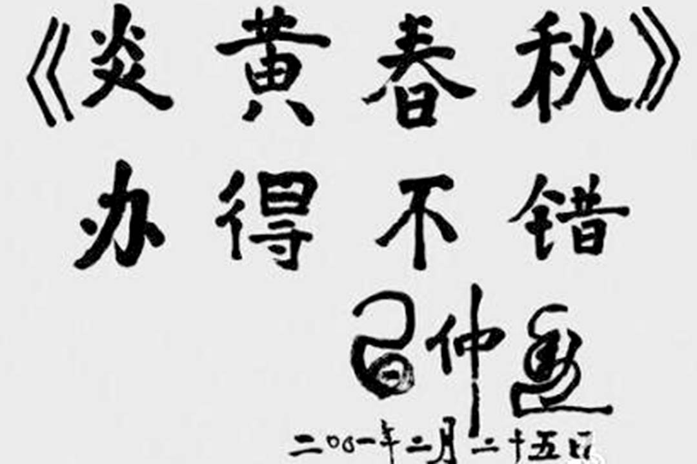

# 笑蜀：斬首《炎黃春秋》，談何「不忘初心」｜觀點｜端傳媒 Initium Media

笑蜀

就在不到一個月前，中共總書記習近平先生，在七一講話中還不厭其煩地、濃墨重彩地反覆提醒全黨要「不忘初心」……

2016-07-28

* * *

《炎黃春秋》雜誌曾被習近平的父親、中共元老習仲勛親筆題字讚賞「炎黃春秋，辦得不錯」。網上圖片

《炎黃春秋》雜誌，是中共體制內改革派的一個輿論平台。1991年由蕭克上將創辦，指名趙紫陽舊部、1980年代的新聞出版署署長杜導正主持。其編輯、作者，亦多數為中共離退休老幹部和中老年高級知識分子。他們的思想體系，大致不出「兩頭真」的範圍。

所謂「兩頭真」，一頭是指他們的早年，一頭是指他們的晚年。他們多數知識分子出身，早年受兩個方面的影響：一是「五四」傳統的影響，因而狂熱地追求所謂「科學」、「民主」；二是世界性左傾思潮的影響，因而堅信蘇聯的政治宣傳，認為蘇聯道路才是中國的道路。這就註定了他們必然不滿國民黨的一黨統治，屬於國民黨統治區的政治異議分子。

## 中共與知識界的蜜月期與破裂

但在當時，他們政治上的選項並不多：夾在國共兩黨之間的所謂第三勢力，過於文弱；足以跟國民黨政府抗衡的陣營，非共產黨莫屬。更重要的是，中共吸取大革命時期階級鬥爭、四面開戰終致失敗的慘痛教訓，開始以第二次國共合作為起點，努力與自己從前的敵人之一（即中間社會）和解，爭取其同情與支持，為此表現出相當的開放和包容，尤其包容了中間社會主流的政治主張，即憲政主張。

中共因而在這一時期成了全國性憲政運動的重要力量。延安有官方組織的「憲政促進會」，毛澤東親任理事。中共還在其國統區機關報《新華日報》發表了大量抨擊一黨專政、呼籲憲政民主的社論評論，在國統區尤其在青年知識分子中廣受歡迎。中共中央所在地延安，一時竟成「民主」明燈，與「獨裁」的陪都重慶形成鮮明對照。

這是中國知識界與中共的蜜月期。成千上萬青年知識分子滿懷理想，從國統區絡繹不絕地投奔中共，以致整個延安時期，中共知識分子比例之高創歷史紀錄。後來《炎黃春秋》雜誌的核心人物，如主持人杜導正，主要支持者李慎之、李鋭、朱厚澤、何方、何家棟、謝韜、馮蘭瑞等，當年都是這樣投身中共的。憲政民主就是他們的初心，他們也堅信他們與黨同心，即他們的初心也是黨的初心。以這種初心相標榜，中共成功地爭得政治上的主動，得到幾乎整個中間社會尤其知識界的支持，在八年抗戰中迅速崛起。

中共1949年掌握全國政權之後的故事，就是盡人皆知了：毛澤東時代的中共越來越走向極端，走向當年所謂初心的反面，最終遭遇空前危機，從而有鄧小平時代的改革開放。

## 改革開放，與《炎黃春秋》的誕生

所謂改革開放，跟抗戰時中共的戰略調整頗為相似，即因創巨痛深，中共不得不有所反思，收斂極端，跟社會、跟世界和解，重聚國家的生機與活力。在思想上、文化上，當時的中共也表現出相應的開放與包容。

從國統區投身中共的知識分子，在毛澤東時代掩埋了初心，要麼隨波逐流，要麼歷經劫難，當年初心都成了恐懼之源。但改革開放讓他們有如枯木逢春，他們在政治上重新活躍起來，成了改革開放最有力的支持者，當年的初心也重新萌發。

初心的全面開展，則始於1990年代。那時他們已到耄耋之年，大多離退休，無官一身輕；尤其因為八九學運慘遭鎮壓，令他們極度震驚。他們大多屬於胡耀邦、趙紫陽的舊部，要麼因為學者出身，本身有強大的反思能力，如李慎之；要麼因為跟晚年趙紫陽過從甚密，有趙紫陽自我反省的帶動，如杜導正。

如果說1971年爆發的林彪事件震撼全黨，成了中共執政後第一次思想解放運動的先聲；那麼八九學運慘遭鎮壓，則成了中共執政後第二次思想解放運動的起點。由此才可以解釋為什麼在鄧小平南方講話之前，「反和平演變」的白色恐怖之中，蕭克上將竟能逆流而上，成功創辦《炎黃春秋》雜誌，並且開宗明義以「說真話、寫信史」號召天下。

## 歷史與政治言論的特區

《炎黃春秋》雜誌就這樣逐漸成了獵獵大旗。黨內、體制內的改革派尤其當年胡趙舊部，總之整個「兩頭真」群體，逐漸向《炎黃春秋》雜誌聚攏。他們當然也不是鐵板一塊，也有差異。李慎之、何家棟、朱厚澤行之最遠，反思和批判最徹底、最決絕，對體制完全不抱希望，觀念上更多屬於自由主義序列；李鋭、杜導正、謝韜、何方等則相對温和，主張上下互動、體制內外合力，讓中共能軟着陸，實現從革命黨到憲政黨的轉型，觀念上更多屬於民主社會主義序列，這在「兩頭真」群體中應該屬於主流。

但他們內部的這種微妙差異，並沒有公開化，而是一直比較默契，不乏凝聚力、向心力。25年來，他們以《炎黃春秋》為平台，主要推動了以下三件事：

一、搶救歷史真相。這點國內媒體無出其右。其意義不限於史學，更在於對未來轉型的推動：真相是轉型正義的第一要件。《炎黃春秋》一直致力於此，從未懈怠。沒有它的這份堅持，好多關鍵真相都會因當事人跨鶴西去而湮沒無聞。

二、傳播憲政民主與公民社會常識。除了歷史文章，《炎黃春秋》還有大量政論。而其所有政論，無不圍繞憲政民主和公民社會兩大主題展開。即便這兩大主題在2012年之後淪為敏感詞，《炎黃春秋》仍不改初心，不作任何讓步。如其2013年新年獻辭，標題即為《憲法是政治體制改革的共識》。

三、傳播民主社會主義理念，代表作即為謝韜發表於《炎黃春秋》2007年第2期的長文《[民主社會主義模式與中國前途](http://www.yhcqw.com/html/yjy/2008/420/08420105457EJH1I1817I1G7K2KICIH6BBC.html)》，發表後反響巨大。如果說李慎之《[風雨蒼黃五十年](http://www.21ccom.net/articles/sxwh/shsc/article_201001202558.html)》是半個多世紀來自由主義在中國第一次浮出水面，謝韜此文則無疑是半個多世紀來民主社會主義在中國第一次浮出水面。

眾所周知，中國幾乎沒有新聞自由、言論自由可言。但在2013年之前，事實上存在着兩個局部意義上的新聞特區、言論特區──即《南方週末》和《炎黃春秋》，民間通稱「一報一刊」。同氣相求，分居南北兩地的「一報一刊」，彼此也有某種程度的呼應。但自2013年南週新年獻辭事件起，《南方週末》即遭全面壓制而逐漸淪陷，《炎黃春秋》頓形孤立無援，成了言論市場上各種極端勢力集中攻擊的目標，處境日益艱危。

## 杜導正的「五不怕」與不屈

對此，《炎黃春秋》尤其領軍人杜導正，其實早有思想準備。筆者的一段親歷堪為註腳。

2011年春，杜老託友人打電話給我，要我到北京找他，我遵囑前往。杜老先問我：我們想請閣下做雜誌社的編委，閣下意向如何？我大喜過望、滿口應承的同時也有幾分惶恐和不解：「《炎黃春秋》編委不是德高望重，就是學界精英。我何德何能而竟忝居其列？」杜老大概讀出了我眼裏的問號，說：「請你當編委，主要是想保護你。有這麼個頭銜，以後他們如果要動你，我們為你說話，就天經地義了。」

杜老此話一出，暖流即刻湧遍我的全身，我不禁感激莫名。須知，那是我一生中最艱難的節點之一。因為年初所謂「苿莉花革命」的牽連，我遭當局從《南方週末》除名，不僅流落江湖，而且風聲鶴唳中隨時有淪為階下囚的可能。而此前我雖然也是《炎黃春秋》作者，但與杜老並沒有多少私人交往。他能在關鍵時刻相助，無疑基於公心，即基於對我的價值立場的高度認同。這實際上不只是保護我，也很可能是杜老自己價值立場的間接宣示。

隨後，杜老還談了很多很多。談他當年如何左，談他晚年如何覺醒，談《炎黃春秋》如何歷盡坎坷。印象最深刻的，是他強調的「五不怕」。他說，以後的形勢會越來越險惡，《炎黃春秋》可能隨時命懸一線。但是，他說，他不怕，「毛主席講五不怕，我正好用得着」。第一，離婚不可能；第二，砍頭不至於；第三，坐牢也不至於；第四，撤職，停退休金，這不怕，兒女養得起；第五，開除黨籍，這也不怕，組織上開除，思想上沒法開除。

最後，他補充說：「我其實還真有一怕，那就是毛主席沒提到的，取消醫療待遇。你知道到了我這個級別的幹部，生病住院都是國家包幹。哪天身體出了大問題，這醫療費可是兒女包不起的。但轉念一想，我都89歲了，馬上就90了，活到這歲數也可以想開了，也不怕！」

今天回頭看，杜老真不是隨便一說，真是早做好了最壞打算：雜誌能堅持多久就堅持多久，一期也不耽誤，一篇文章也不耽誤，把可能的空間用到極致。但如果實在無法堅持，則堅決玉碎，泰山壓頂也不妥協，決不苟且偷生。

## 「泰山壓頂」的蠻橫

泰山壓頂的時刻終於來到了。這本在意料之中。出人意料的只是來到的方式，太流氓，太卑劣。杜老夫人剛去世不久，杜老還沉浸在哀痛中，並因生病住院，中國藝術研究院（名義上的主管機關）偏偏選擇此時朝《炎黃春秋》下手，撤換社長杜導正、副社長胡德華和總編輯徐慶全，並由中國藝術研究院派員接替。雜誌社原本的社委會、執行主編制也一同被棄，這實際上是對《炎黃春秋》的「斬首」，並且屬於典型的趁人之危。

《炎黃春秋》實際上一直是體制外獨立運作。25年前從零起步，國家不曾投入一分錢、一個編制，所有成果都是《炎黃春秋》同仁辛勤勞作的積累，與所謂主管方即中國藝術研究院沒有任何關係。中國藝術研究院無非是官方硬性指派掛名主管，並受雙方事先簽署的協議約束。協議明確規定雜誌社人事、發稿和財務的自主權。其趁杜老病重難以視事，強行接管雜誌社人事、發稿和財務，顯屬單方面推翻協議，法律上沒有任何效力可言。

但不幸的是，中國離法治太遠。大有來頭的中國藝術研究院，以文革方式佔領《炎黃春秋》雜誌社，律師訴諸公堂亦不被受理，法律無力約束權力的專橫。繼《南方週末》淪陷之後，《炎黃春秋》這最後一個講初心、講真話的平台，也不能不選擇停刊，不能不悲壯地沉沒了。從此之後，偌大個中國，將再無一寸言論市場，真是白茫茫一片好空曠。

就在不到一個月前，中共總書記習近平先生，在七一講話中還不厭其煩地、濃墨重彩地反覆提醒全黨要「不忘初心」。餘音尚繞樑，真正不忘初心的《炎黃春秋》雜誌卻遭致命偷襲而轟然倒地，不忘初心的代價高昂至此，寧不令人寒心？事實上，《炎黃春秋》雜誌所堅守的初心，所堅持的胡趙路線，是中共歷史上僅有的正資產。對《炎黃春秋》雜誌的致命偷襲，可否理解為與這僅有的正資產的最後訣別？

**（笑蜀，前《南方週末》評論員、《炎黃春秋》雜誌編委）**

---------------------------------------------------

原网址: [访问](https://theinitium.com/article/20160728-opinion-xiaoshu-yanhuang/)

创建于: 2019-02-17 13:01:12
