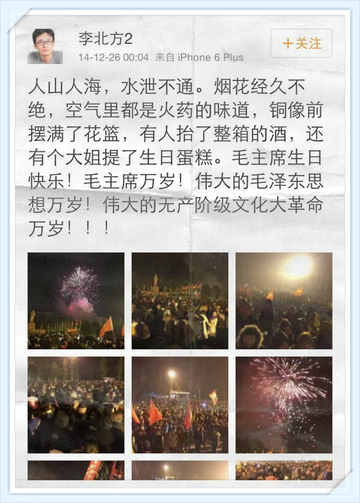

# 『炎黄春秋』易帜记 – 文三娃

Posted on [2017年7月12日](https://wentommy.wordpress.com/2017/07/12/%e3%80%8e%e7%82%8e%e9%bb%84%e6%98%a5%e7%a7%8b%e3%80%8f%e6%98%93%e5%b8%9c%e8%ae%b0/) by [wentommy](https://wentommy.wordpress.com/author/wentommy/)

2016年7月12日，老牌杂志《炎黄春秋》重大变故如约而至，重要职务全部为“组织”派来的人所取代，原社长、总编辑杜导正、副社长胡德华和总编辑徐庆全等均被撤换。

​旧班子在回应声明中表示，不同意组织空降人员接管编辑部，认为这是单方终止中国艺术研究院和杂志之间达成的协议书，并表示已委托律师对该院提起诉讼。

抵抗者的言行正应了那句老话儿：螳臂当车，或者按纽约教练17年口创新词：螳螂挡臂。

旧炎黄把新春秋告上了法庭，但法院拒绝立案。

​ ▼▼▼

​公历二零一六年八月十五，显然被很多人或者机构当成了良辰吉日。

有些人在忙着结婚登记，有些组织，比如《炎黄春秋》，在忙着改弦更张。

前空军校官飞行员、 乌有之乡在军界前重要联络官郭松民先生，与戴旭司令等联袂出阵，顺利接管了这家老牌杂志社的防务。

这份杂志在郭次帅眼里，曾为烂污一团的“化粪池”。

**延伸阅读**

[郭松民考](https://wentommy.wordpress.com/2017/04/18/%e9%83%ad%e6%9d%be%e6%b0%91%e8%80%83/)

​郭姓将领引用了主席名句：“萧瑟秋风今又是，换了人间！”

这引起了另外一位著名将领兼河南乡党——戴旭司令的剧烈共鸣。

郭松民郭老之所以能够成为新炎黄骨干，重新定义春秋，主要是因为他在国民语言教育、朝鲜拥核问题、台海开战时机、政坛人事安排等领域拥有的超凡脱俗的能力。

郭松民对朝核问题发表重要讲话

​ 亦有网友咨询笔者，为何邀请戴司令作为军代表？这么说吧，旭帅能文能武，集笔杆子和枪杆子于一身，他的“二杆子”思想，将成为新春秋重新定义历史的指导方向。

**延伸阅读**

[鹰帝考](https://wentommy.wordpress.com/2017/04/26/%e9%b9%b0%e5%b8%9d%e8%80%83/)

经济学家梅新育先生，与这份杂志也是不打（官司）不相识。

​与郭次帅一样，梅先生与炎黄再次交集之时，摇身一变成了主人。

除了戴郭两位著名将领，新春秋里还有像李北方先生这样的青年才俊。

北方先生先后毕业于北京大学、伦敦政治经济学院，他亦是香港理工大学访问学者，著名杂志《南风窗》前主笔。

北方先生帖中提及的李锐先生，乃备受自由派知识分子推崇的体制内“两头真”，与这份元老院院刊型杂志渊源颇深。

2019年2月16日，李锐仙游，享年101岁。

炎黄大计，春秋梦语；百年人生，胡佛西寄。

北方先生尽管外型儒雅，学富五车，但内心狂野不羁，文人命，武人范，尤其表现于口语。

北方先生国骂

**延伸阅读**

[左翼文人之“金莲”情结](https://wentommy.wordpress.com/2017/12/19/%e5%b7%a6%e7%bf%bc%e6%96%87%e4%ba%ba%e4%b9%8b%e9%87%91%e8%8e%b2%e6%83%85%e7%bb%93/)

[刀笔书生李北方](https://wentommy.wordpress.com/2018/03/04/%e5%88%80%e7%ac%94%e4%b9%a6%e7%94%9f%e6%9d%8e%e5%8c%97%e6%96%b9/)

这个庄严隆重的接管仪式上，也出现了一点小插曲。

虽同为著名毛派学者，但李北方先生和司马南先生却不大对付，主办方千不该万不该，将北方和马南的桌签名牌放在了一块。

李司二位，就像是毛主义者中的什叶派和逊尼派。

2015年，李北方点评司马南

事实证明，虚惊一场。

司老师的名签虽然出现在了会场，但他的真身却在了其它地方。

​外媒援引了司先生的说明：

**炎黄春秋这件事情，网上都在说司马南去参加会了，事实上我没去。有人在开会前一天晚上给我发了短信，但是这个人我不认识，我不知道他是谁，我从来没有参加过炎黄春秋的任何活动（[笔者注：严格说他在2013年参加过现场抵制该杂志副主编讲座的活动](http://www.wyzxwk.com/Article/yulun/2013/04/301047.html)），他们没告诉我这个会是怎么回事，所以我就没去。会议召开前一个小时，林治波（人民日报甘肃分社原社长）给我联系，说桌签儿都写了你了，你马上来。我说不行，你们这会我又不知道背景。 **

[被报参加炎黄作者恳谈 司马南辟谣](https://www.voachinese.com/a/news-yanhuang-chunqiu-maoist-writer-denied-attending-meeting-on-out-spoken-magazine-20160816/3467664.html)

 这场接管仪式上撑门面的印刷品是该杂志“重生”之后的第八期。

用戴司令的话讲，基本达到“无毒能看的程度了”。

司令盛赞整肃效果​

​接踵而至的新杂志，成色越来越红润，用网友乔木先生的话港，基本可以称为《乌有春秋》了。

杂志第九期的核心作者里，毛派读者惊喜地发现了刘仰和林治波两位著名的毛思想继承人和教育家。

2016年第九期

[第九期《炎黃春秋》出版 取消刊登顧問名單](http://hk.apple.nextmedia.com/realtime/china/20160912/55633093)

新杂志发行到第11期，作者队伍和文章水平，应该能令戴旭司令浮好几大白了。

戴司令平生最喜收集的各国精英对毛泽东主席的评价，流传最广的是下面这一条。

**英国将军奥特曼**称：“毛泽东是掌握打开这个时代军事奥秘之锁全套钥匙的人”。

**延伸阅读**

 [洋人漂亮话与民族自尊心](https://wentommy.wordpress.com/2017/08/07/%e6%b4%8b%e4%ba%ba%e6%bc%82%e4%ba%ae%e8%af%9d/)

不少军迷对是否存在英国将军“奥特曼”、以及奥特曼将军是否说过这番话等问题，提出了质疑。

司令也很有风度，他建议网友去咨询“军事科学院战略部部长姚有志少将”，也就是《炎黄春秋》最新倚重的核心作者。

戴司令有力有礼有节的反驳

姚少将的文章的确提到过“英国奥特曼将军”有过这段表述，与戴司令互为证据，避免了孤证的尴尬。

​ ▼▼▼

​2017年初，笔者回老家重庆省亲，在观音桥商圈的西西弗书店翻阅到了2016年最后一期杂志。

​​最后一篇写司徒雷登的文章，作者叫刘小渔。

​刘小渔？这个作者名字跟戴旭、刘仰、林治波等鼎鼎大名比起来，有些不起眼儿。

他又名**地瓜熊老六**。

一度暗淡下去的舞台灯光，一下子打到了最炫最亮。

网友们，让我看见你们的双手！

“要去把阵地抢回来，”站在舞台上，正能量新晋红人地瓜老师轻轻地说。

​​由于阵地是新打下来的，占领者在狂喜之后，也陆续出现了一些水土不服的现象，战友之间的配合，也出现了一些不应该的失误。

比如说在对2017年中叶出现的印度问题，戴司令和熊老师就产生了分歧。

地瓜老师批评公知煽动中印开战​

戴旭司令致力于挑起中印战端

​ ▼▼▼

读者们惊奇地发现，改组后的新《炎黄春秋》，不论从采编团队还是到核心作者，清一色毛派将领或学者。

**如果说，老炎黄像元老院院刊型杂志，新春秋则似润之纪念堂堂刊型读本。**

** 延伸阅读**

[毛派的抗争](https://wentommy.wordpress.com/2017/05/17/%e6%af%9b%e6%b4%be%e7%9a%84%e6%8a%97%e4%ba%89/)

李北方先生在亲临韶山祭奠东圣，纪念文革。

  近几年，民间总有传说，中央已经发出红头文件，对于反毛的人要立即处理，这份文件虽然没有得到中办或者国办的确认，但早就传得有鼻子有眼，中央也是没有太好的办法否认这份文件的存在，毕竟像戴旭司令这样的鹰派将领，早在2013年，就对此做出了重要批示，并且写下了一首气势滂沱的诗歌。

戴司令的激情诗

旭帅这首几可比肩东圣的大诗，居然被新浪微博屏蔽，后者的阶级成分，昭然若揭。

郭次帅呼唤主席精神

熊老六影射吴建民车祸是因不敬主席

东圣节抒怀

梅新育欢度东圣节

林治波先生称毛泽东是伟人中的伟人

**延伸阅读**

[西部英雄林社长](https://wentommy.wordpress.com/2017/04/24/%e8%a5%bf%e9%83%a8%e8%8b%b1%e9%9b%84%e6%9e%97%e7%a4%be%e9%95%bf/)

​ ▼▼▼

这份杂志的新总编、法人代表郝庆军先生，是周小平先生铁粉。

[郝庆军先生向青年学子推荐周小平名篇《请不要辜负这个时代》](http://jxdw.xztc.edu.cn/music/detail.asp?mmflid=0&ShowId=380)​

郝总编有多重身份，在接管《炎黄》前，他是中国艺术研究院旗下杂志《传记文学》主编。

《春秋》的新社长贾磊磊先生是该院副院长，他还有一个身份：广电总局审查委员会委员。

从2017年下半叶起，中国大陆现在要去影院看电影啊，跟去正规KTV消费前必须听一段“拒绝黄拒绝毒拒绝黄赌毒”类似，必须先过一遍3分多钟的“中国梦”宣传片，才能看到正片。

而这段由成龙等艺人代言的中国梦宣传片的文案，把关人就有周小平。

编剧阵容，特别牛

这个宣传片由于有成龙大哥的加入，引起了一些争议，其中一位旅居北京大兴黄村的四川江津籍推友 [@wentommy](https://wentommy.wordpress.com/mentions/wentommy/) 就表达了不解。

**自贡小平就不用说了，我老乡，全球正能量第一人。代言『中国梦』的成龙大哥算怎么回事儿，选角导演难道没有事先百度过成先生的代言史麽？宣传出了偏差，该谁负责？演员麽，不能吧，本山与蚁力神、晓明与东虹桥、成龙与……（此处省略100字）如何保护中国梦？大家来港一港。**

**​ ▼▼▼  
**

同新一届炎黄春秋的班子一样，正国级青年导师、大中华精神担当、笔者老乡小平先生，也是认证了的主席粉丝。

毛泽东诞辰123周年

热心读者感谢小平、感谢毛爷爷

红旗未改，主席放心

​**延伸阅读**

[周小平专题](https://wentommy.wordpress.com/%e5%91%a8%e5%b0%8f%e5%b9%b3%e4%b8%93%e9%a2%98/)

话已至此，在缅怀炎黄易帜之际，我们必须再度唱响主席名句：

**萧瑟秋风今又是，换了人间！ **

------

原网址: [访问](https://wentommy.wordpress.com/2017/07/12/%e3%80%8e%e7%82%8e%e9%bb%84%e6%98%a5%e7%a7%8b%e3%80%8f%e6%98%93%e5%b8%9c%e8%ae%b0/)

创建于: 2019-02-17 23:08:36