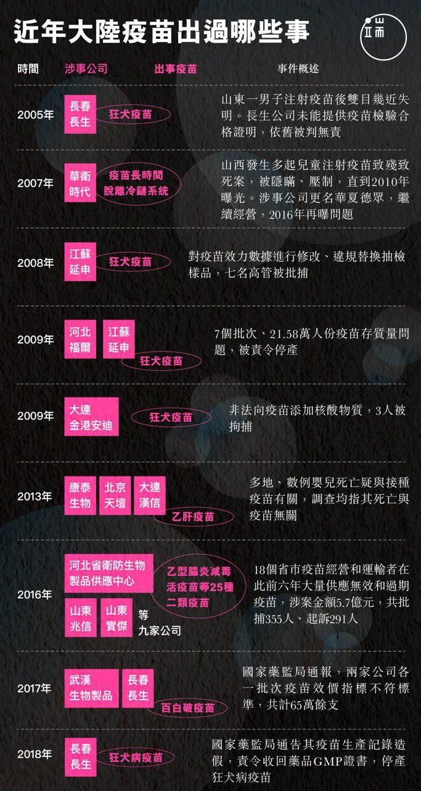

# 問題疫苗企業被罰91億後，今冬流感疫苗產量十年最低

【新聞回顧】7月21日，自媒體人「獸爺」在微信公眾號發表《疫苗之王》，梳理了三位疫苗生產企業「大佬」不光彩的發家史，牽出此前兩個批次、65萬多支兒童疫苗被發現不合標一事，更令人憤慨的是——官方在發佈公告九個月後，依舊未公佈疫苗的生產記錄和召回情況。儘管很快遭遇全網刪稿，《疫苗之王》依舊掀起了罕見的關注和憤慨。端傳媒整理發現，中國大陸在近十幾年裏發生過多起問題疫苗事件。

總理李克強在第二天表態，要徹查所有疫苗生產和銷售流程。第四天，涉事企業長春長生生物科技有限公司（下稱「長生生物」）董事長高俊芳等15人被捕。第五天，之前遲遲未公佈的問題疫苗流向全部查明。這件醜聞導致七名涉案的省部級官員被問責。長生生物被吊銷藥品生產許可證，並處以91億元人民幣罰款——創下中國對藥企罰款的最高紀錄。

中國對疫苗的監管亦趨向嚴格。據內地媒體《人物》、騰訊棱鏡報道，截止11月中，獲得上市許可的流感疫苗數量僅為2017年的一半左右，疫苗產量為10年最低水平。除卻曾佔據15%市場的長生生物外，幾家流感疫苗主要生產企業也因各種原因「斷供」，造成市場嚴重短缺。

問題疫苗曝光後，內地掀起赴港注射疫苗的熱潮，相關攻略更是火遍各類母嬰論壇。今冬內地流感疫苗出現緊缺後，亦有不少家長帶孩子去香港接種，據大公網報道，有診所的內地客人比去年增長3成左右。這導致香港疫苗供應緊張，據《人物》報道，如今去香港打疫苗，也需至少提前一周預訂。

----

 [原文：《2018年中國發生的那些大新聞，後來怎麼樣了？》](https://theinitium.com/roundtable/20181220-roundtable-zh-mainland-news-2018/)
© 端傳媒 Initium Media